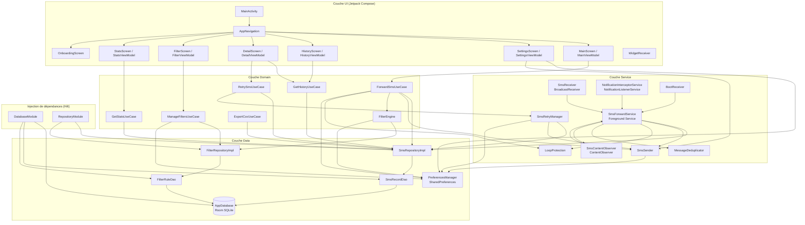
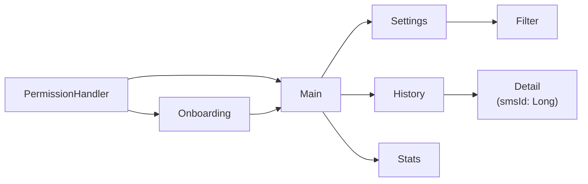
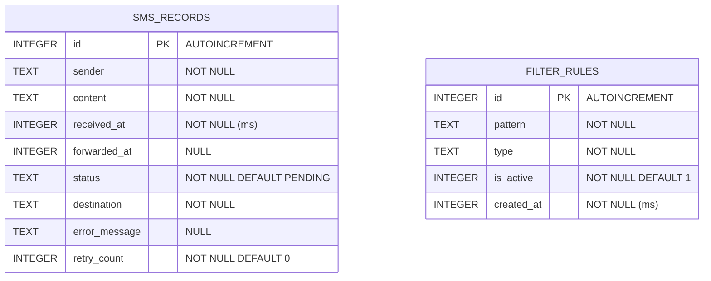

# Architecture — SMS Forwarder

## Table des matières

- [Vue d'ensemble](#vue-densemble)
- [Diagramme d'architecture](#diagramme-darchitecture)
- [Couche Data](#couche-data)
- [Couche Domain](#couche-domain)
- [Couche Service](#couche-service)
- [Couche UI](#couche-ui)
- [Injection de dépendances (Hilt)](#injection-de-dépendances-hilt)
- [Flux de capture SMS/RCS](#flux-de-capture-smsrcs)
- [Schéma de base de données](#schéma-de-base-de-données)
- [Décisions d'architecture](#décisions-darchitecture)
- [Gestion du lifecycle Android](#gestion-du-lifecycle-android)

---

## Vue d'ensemble

**SMS Forwarder** est une application Android qui transfère automatiquement les SMS et messages RCS reçus vers un numéro de destination configuré par l'utilisateur. L'application supporte trois sources de capture (BroadcastReceiver, ContentObserver, NotificationListenerService) pour garantir la réception des messages quelle que soit l'application de messagerie utilisée.

| Attribut | Valeur |
|---|---|
| Package | `com.qrcommunication.smsforwarder` |
| Min SDK | 26 (Android 8.0 Oreo) |
| Target SDK | 35 |
| Compile SDK | 36 |
| Langage | Kotlin 2.0.21 |
| UI | Jetpack Compose + Material You (Material3) |
| Architecture | MVVM + Clean Architecture |
| DI | Hilt 2.51.1 |
| Base de données | Room 2.6.1 |
| Version | 1.0.0 |

---

## Diagramme d'architecture



---

## Couche Data

Responsable de la persistance et de l'accès aux données. Aucune logique métier ne réside dans cette couche.

### AppDatabase

Classe Room qui déclare la base de données SQLite. Fichier : `data/local/AppDatabase.kt`.

```kotlin
@Database(
    entities = [SmsRecord::class, FilterRule::class],
    version = 1,
    exportSchema = false
)
abstract class AppDatabase : RoomDatabase() {
    abstract fun smsRecordDao(): SmsRecordDao
    abstract fun filterRuleDao(): FilterRuleDao
}
```

Le nom du fichier de base de données est `sms_forwarder_db`.

### Entités Room

**SmsRecord** (`data/local/entity/SmsRecord.kt`) — Représente un message traité par l'application.

| Champ | Type Kotlin | Colonne SQL | Description |
|---|---|---|---|
| `id` | `Long` | `id` | Clé primaire auto-incrémentée |
| `sender` | `String` | `sender` | Numéro de l'expéditeur |
| `content` | `String` | `content` | Corps du message |
| `receivedAt` | `Long` | `received_at` | Timestamp de réception (ms) |
| `forwardedAt` | `Long?` | `forwarded_at` | Timestamp de transfert (ms, null si non envoyé) |
| `status` | `String` | `status` | Valeur de `SmsStatus` |
| `destination` | `String` | `destination` | Numéro de destination configuré |
| `errorMessage` | `String?` | `error_message` | Message d'erreur en cas d'échec |
| `retryCount` | `Int` | `retry_count` | Nombre de tentatives effectuées |

**FilterRule** (`data/local/entity/FilterRule.kt`) — Représente une règle de filtrage.

| Champ | Type Kotlin | Colonne SQL | Description |
|---|---|---|---|
| `id` | `Long` | `id` | Clé primaire auto-incrémentée |
| `pattern` | `String` | `pattern` | Numéro ou mot-clé à filtrer |
| `type` | `String` | `type` | Valeur de `FilterType` |
| `isActive` | `Boolean` | `is_active` | Règle active ou désactivée |
| `createdAt` | `Long` | `created_at` | Timestamp de création (ms) |

### DAOs

**SmsRecordDao** (`data/local/dao/SmsRecordDao.kt`) — Interface Room pour les opérations sur `sms_records`. Toutes les méthodes de lecture retournent des `Flow<>` pour l'observation réactive, à l'exception des méthodes de recherche par date et par ID qui retournent des valeurs ponctuelles.

**FilterRuleDao** (`data/local/dao/FilterRuleDao.kt`) — Interface Room pour les opérations sur `filter_rules`. `getAllRules()` et `getRulesByType()` retournent des `Flow<>`. `getActiveRules()` retourne une `List<FilterRule>` suspendue, utilisée au moment de l'évaluation d'un filtre.

### Repositories

Les repositories exposent des interfaces stables pour que le domain ne dépende jamais directement des DAOs Room.

| Interface | Implémentation | Rôle |
|---|---|---|
| `SmsRepository` | `SmsRepositoryImpl` | Lecture/écriture des `SmsRecord` |
| `FilterRepository` | `FilterRepositoryImpl` | Lecture/écriture des `FilterRule` |

`SmsRepositoryImpl` ajoute la logique de mise à jour partielle dans `updateStatus()` : si le statut passe à `SENT`, le champ `forwardedAt` est automatiquement renseigné avec le timestamp courant.

### PreferencesManager

(`data/preferences/PreferencesManager.kt`) — Singleton Hilt qui encapsule les `SharedPreferences` dans le fichier `sms_forwarder_prefs`. Stocke la configuration utilisateur non-structurée.

| Clé | Type | Valeur par défaut | Description |
|---|---|---|---|
| `destination_number` | `String` | `""` | Numéro de destination au format normalisé |
| `forwarding_enabled` | `Boolean` | `false` | Activation du transfert |
| `first_launch` | `Boolean` | `true` | Affichage de l'onboarding |
| `filter_mode` | `String` | `"NONE"` | Mode de filtrage actif |
| `sms_forwarded_count` | `Int` | `0` | Compteur de SMS transférés avec succès |
| `selected_sim_slot` | `Int` | `-1` | Slot SIM sélectionné (-1 = défaut) |

---

## Couche Domain

Contient la logique métier pure, indépendante d'Android. Les UseCases orchestrent les interactions entre repositories et services.

### UseCases

**ForwardSmsUseCase** (`domain/usecase/ForwardSmsUseCase.kt`)

Orchestre le transfert d'un message. Séquence d'exécution :
1. Vérifie que la destination est configurée.
2. Vérifie que le transfert est activé.
3. Vérifie l'absence de boucle (`LoopProtection`).
4. Évalue les règles de filtrage (`FilterEngine`).
5. Insère un enregistrement `PENDING` en base.
6. Envoie le SMS via `SmsSender`.
7. Met à jour le statut en `SENT` ou `FAILED`.

Retourne un `sealed class ForwardResult` : `Success`, `Filtered`, `Failed`, `Skipped`.

**GetHistoryUseCase** (`domain/usecase/GetHistoryUseCase.kt`)

Expose des `Flow<List<SmsRecord>>` pour la liste de l'historique, avec support de la recherche full-text (sender + content) et du filtrage par statut.

**GetStatsUseCase** (`domain/usecase/GetStatsUseCase.kt`)

Calcule deux types de statistiques :
- `getOverallStats()` : combine 5 flux Room en un `Flow<SmsStats>` avec compteurs par statut et taux de succès.
- `getDailyStats(days: Int)` : retourne une `List<DailyStats>` pour les N derniers jours, en agrégeant les enregistrements par tranche journalière.

**ManageFiltersUseCase** (`domain/usecase/ManageFiltersUseCase.kt`)

CRUD complet sur les règles de filtrage. Gère également le mode de filtrage global (NONE / WHITELIST / BLACKLIST) via `PreferencesManager`. La suppression de toutes les règles remet le mode à `NONE` automatiquement.

**RetrySmsUseCase** (`domain/usecase/RetrySmsUseCase.kt`)

Réessaie l'envoi d'un enregistrement en statut `FAILED`. Vérifie que le compteur `retryCount` est inférieur à `SmsRetryManager.MAX_RETRIES` (3). Retourne un `sealed class RetryResult` : `Success`, `Failed`, `NotFound`, `MaxRetriesReached`.

**ExportCsvUseCase** (`domain/usecase/ExportCsvUseCase.kt`)

Exporte l'intégralité de l'historique en CSV (UTF-8) vers un `Uri` fourni par le sélecteur de fichiers Android ou vers un fichier interne. Les guillemets dans le contenu sont échappés selon la RFC CSV.

### FilterEngine

(`domain/validator/FilterEngine.kt`) — Évalue si un message doit être transféré selon le mode actif et les règles configurées.

**Modes** (enum `FilterMode`) :
- `NONE` : tout message est transféré.
- `WHITELIST` : seuls les messages correspondant à une règle WHITELIST active sont transférés.
- `BLACKLIST` : les messages correspondant à une règle BLACKLIST active sont bloqués.

**Logique de correspondance** dans `matchesRule()` :
1. Si le pattern est un numéro de téléphone valide : comparaison après normalisation E.164.
2. Sinon : recherche insensible à la casse dans le numéro d'expéditeur et le corps du message.

### Utilitaires

**PhoneValidator** (`util/PhoneValidator.kt`) — Valide et normalise les numéros de téléphone. Accepte les formats E.164 (`+33XXXXXXXXX`), local français (`0XXXXXXXXX`) et international avec préfixe double zéro (`0033XXXXXXXXX`). La méthode `normalize()` convertit tout format vers E.164.

**SmsFormatter** (`util/SmsFormatter.kt`) — Formate le message transféré selon le template `[De: {sender} | {date}] {content}`. Calcule également le nombre de parties SMS pour les messages longs (seuil : 153 caractères par partie en multipart).

**DateFormatter** (`util/DateFormatter.kt`) — Formatage des timestamps en formats lisibles (court, long, relatif, CSV).

---

## Couche Service

Contient les composants Android qui opèrent en arrière-plan. Cette couche est découplée du UI et interagit directement avec la couche Data.

### SmsForwardService

(`service/SmsForwardService.kt`) — Foreground Service principal. Point d'entrée de tous les messages à traiter.

Cycle de vie :
- `onCreate()` : lance la notification persistante, instancie et enregistre le `SmsContentObserver`.
- `onStartCommand()` : traite les actions `ACTION_FORWARD_SMS` (transfert d'un message) et `ACTION_STOP_SERVICE` (arrêt propre).
- `onDestroy()` : annule le `CoroutineScope` (superviseur), désenregistre le `SmsContentObserver`.

Le service utilise `START_STICKY` pour être relancé par Android après un kill système. Sur Android 14+ (API 34), il déclare `FOREGROUND_SERVICE_TYPE_SPECIAL_USE`.

Le traitement effectif de chaque message dans `handleForwardSms()` :
1. Appel à `MessageDeduplicator.shouldProcess()` — abandon si doublon.
2. Vérification de la destination et de l'état d'activation.
3. Appel à `LoopProtection.isLoopDetected()` — abandon si boucle.
4. Insertion en base avec statut `PENDING`.
5. Appel à `SmsSender.sendSms()`.
6. Mise à jour du statut en `SENT` ou `FAILED`.

### SmsReceiver

(`receiver/SmsReceiver.kt`) — `BroadcastReceiver` déclaré avec la priorité 999 pour l'action `android.provider.Telephony.SMS_RECEIVED`. Délègue immédiatement au `SmsForwardService` via `startForegroundService()`.

### SmsContentObserver

(`service/SmsContentObserver.kt`) — Observe `content://sms/inbox` pour capturer les messages qui n'arrivent pas via `SMS_RECEIVED` (RCS gérés par certaines applications, Samsung Messages). Mémorise le dernier ID traité pour ne requêter que les nouveaux enregistrements à chaque déclenchement de `onChange()`.

### NotificationInterceptorService

(`service/NotificationInterceptorService.kt`) — `NotificationListenerService` qui surveille les notifications postées par les applications de messagerie connues :
- `com.google.android.apps.messaging` (Google Messages)
- `com.samsung.android.messaging` (Samsung Messages)
- `com.android.mms` (AOSP Messages)

Filtre les notifications groupées et les notifications de type `ONGOING`. Relaie les messages capturés au `SmsForwardService`.

### SmsSender

(`service/SmsSender.kt`) — Encapsule l'envoi SMS via `SmsManager`. Gère les messages longs (> 160 caractères) en multipart. Sélectionne le `SmsManager` approprié selon le slot SIM configuré (API 31+ via `SubscriptionManager`).

### MessageDeduplicator

(`service/MessageDeduplicator.kt`) — Prévient le traitement multiple d'un même message capturé par plusieurs sources simultanément. Le hash est calculé sur `sender + content(100 chars) + timestamp arrondi à 5 secondes`. Le cache est limité à 500 entrées et les entrées expirent après 60 secondes.

### LoopProtection

(`service/LoopProtection.kt`) — Détecte les boucles de transfert en deux étapes :
1. Comparaison directe sender == destination (après normalisation).
2. Comparaison destination == numéro SIM local (lecture via `TelephonyManager.line1Number`).

La normalisation convertit tout format français en E.164 (`+33XXXXXXXXX`).

### SmsRetryManager

(`service/SmsRetryManager.kt`) — Gère la logique de ré-essai avec backoff exponentiel. Délai calculé : `2000ms * 2^retryCount`, plafonné à 30 secondes. Maximum 3 tentatives (`MAX_RETRIES = 3`). Expose `retryAllFailed()` pour relancer tous les enregistrements en échec éligibles.

### BootReceiver

(`receiver/BootReceiver.kt`) — Écoute `BOOT_COMPLETED` et `QUICKBOOT_POWERON` (constructeurs HTC/Huawei). Relit les `SharedPreferences` directement (sans Hilt, car les BroadcastReceivers non-Hilt n'ont pas d'injection) pour vérifier si le transfert était actif avant le redémarrage.

### NotificationHelper

(`service/NotificationHelper.kt`) — Singleton qui crée et met à jour les notifications via deux canaux :
- `sms_forwarding_channel` : notification persistante du Foreground Service (priorité LOW).
- `sms_status_channel` : notifications ponctuelles de transfert réussi (priorité DEFAULT).

---

## Couche UI

Implémentée entièrement en Jetpack Compose. Chaque écran suit le pattern MVVM : un `@Composable` observe un `StateFlow<UiState>` exposé par un `@HiltViewModel`.

### Écrans

| Écran | Fichier | ViewModel | Description |
|---|---|---|---|
| Onboarding | `OnboardingScreen.kt` | — | Présentation au premier lancement |
| Main | `MainScreen.kt` | `MainViewModel` | Tableau de bord avec toggle de transfert |
| Settings | `SettingsScreen.kt` | `SettingsViewModel` | Configuration destination, filtre, SIM |
| History | `HistoryScreen.kt` | `HistoryViewModel` | Liste des transferts avec recherche et filtre |
| Detail | `DetailScreen.kt` | `DetailViewModel` | Détail d'un transfert individuel |
| Filter | `FilterScreen.kt` | `FilterViewModel` | Gestion des règles de filtrage |
| Stats | `StatsScreen.kt` | `StatsViewModel` | Statistiques globales et graphique journalier |

### Navigation

(`ui/navigation/AppNavigation.kt` + `ui/navigation/Screen.kt`)

Navigation pilotée par `NavHostController`. Au démarrage, `PermissionHandler` vérifie les permissions avant d'afficher l'interface. La destination initiale est `Screen.Onboarding` si `isFirstLaunch == true`, sinon `Screen.Main`.



### Widget

(`ui/widget/WidgetReceiver.kt`) — `AppWidgetProvider` qui affiche l'état du service (ON/OFF) et le compteur de SMS. Le bouton de toggle démarre ou arrête le `SmsForwardService` directement depuis le widget sans ouvrir l'application.

### Composants partagés

| Composant | Fichier | Usage |
|---|---|---|
| `PermissionHandler` | `ui/components/PermissionHandler.kt` | Demande les permissions requises au démarrage |
| `PhoneNumberField` | `ui/components/PhoneNumberField.kt` | Champ de saisie avec validation en temps réel |
| `SmsListItem` | `ui/components/SmsListItem.kt` | Élément de liste dans l'historique |
| `StatusBadge` | `ui/components/StatusBadge.kt` | Badge coloré par statut (SENT, FAILED, etc.) |
| `ExportButton` | `ui/components/ExportButton.kt` | Bouton d'export CSV |

### Thème

(`ui/theme/`) — Thème Material You (Material3) avec support du Dynamic Color. Les couleurs de référence sont définies dans `Color.kt`, la typographie dans `Type.kt`, et le thème global dans `Theme.kt`.

---

## Injection de dépendances (Hilt)

Deux modules Hilt déclarés dans `di/` :

**DatabaseModule** — Installé dans `SingletonComponent`. Fournit `AppDatabase` (singleton Room), `SmsRecordDao` et `FilterRuleDao`.

**RepositoryModule** — Installé dans `SingletonComponent`. Lie les interfaces aux implémentations avec `@Binds @Singleton` :
- `SmsRepository` → `SmsRepositoryImpl`
- `FilterRepository` → `FilterRepositoryImpl`

Les services (`SmsSender`, `MessageDeduplicator`, `LoopProtection`, `SmsRetryManager`, `NotificationHelper`, `PreferencesManager`, `FilterEngine`) sont des singletons injectés via `@Singleton` + `@Inject constructor`.

`SmsForwardService` est annoté `@AndroidEntryPoint` pour permettre l'injection de membres avec `@Inject lateinit var`.

---

## Flux de capture SMS/RCS

```mermaid
sequenceDiagram
    participant TEL as Réseau téléphonique
    participant SR as SmsReceiver
    participant SCO as SmsContentObserver
    participant NIS as NotificationInterceptorService
    participant SFS as SmsForwardService
    participant DED as MessageDeduplicator
    participant LOOP as LoopProtection
    participant FE as FilterEngine
    participant DB as Room (SmsRecord)
    participant SMS as SmsSender

    TEL->>SR: SMS_RECEIVED broadcast
    TEL->>SCO: onChange() content://sms/inbox
    TEL->>NIS: onNotificationPosted() (RCS)

    SR->>SFS: startForegroundService(ACTION_FORWARD_SMS)
    SCO->>SFS: callback onNewMessage()
    NIS->>SFS: startForegroundService(ACTION_FORWARD_SMS)

    SFS->>DED: shouldProcess(sender, content, ts)?
    alt Doublon détecté
        DED-->>SFS: false → abandon
    else Nouveau message
        DED-->>SFS: true
        SFS->>LOOP: isLoopDetected(sender, dest)?
        alt Boucle détectée
            LOOP-->>SFS: true → abandon
        else Pas de boucle
            LOOP-->>SFS: false
            SFS->>FE: shouldForward(sender, content)?
            alt Message filtré
                FE-->>SFS: shouldForward=false
                SFS->>DB: INSERT SmsRecord(FILTERED)
            else Message autorisé
                FE-->>SFS: shouldForward=true
                SFS->>DB: INSERT SmsRecord(PENDING)
                SFS->>SMS: sendSms(destination, message)
                alt Envoi réussi
                    SMS-->>SFS: OK
                    SFS->>DB: UPDATE status=SENT
                else Envoi échoué
                    SMS-->>SFS: Exception
                    SFS->>DB: UPDATE status=FAILED
                end
            end
        end
    end
```

---

## Schéma de base de données



Les deux tables sont indépendantes. Il n'existe pas de relation de clé étrangère entre elles : un `SmsRecord` référence le numéro de destination et l'expéditeur sous forme de texte brut.

---

## Décisions d'architecture

### Pourquoi MVVM

Le pattern MVVM est le standard recommandé par Google pour les applications Android modernes avec Jetpack Compose. Le `ViewModel` survit aux rotations d'écran et centralise l'état UI via `StateFlow`, ce qui simplifie le cycle de vie des composables.

### Pourquoi Hilt

Hilt est le framework DI officiel Android, construit sur Dagger 2. Il intègre nativement le cycle de vie Android (Activity, Fragment, Service, ViewModel), ce qui élimine le boilerplate d'initialisation. L'alternative Koin a été écartée pour la robustesse de la vérification à la compilation.

### Pourquoi Room

Room est l'ORM recommandé par Google pour SQLite sur Android. L'intégration native avec les `Flow` Kotlin Coroutines permet l'observation réactive de la base de données sans couche supplémentaire. L'alternative Realm a été écartée pour limiter les dépendances externes.

### Pourquoi ContentObserver pour les RCS

Les messages RCS ne déclenchent pas le broadcast `SMS_RECEIVED`. Deux mécanismes complémentaires couvrent ce cas :
- `SmsContentObserver` observe `content://sms/inbox` : fonctionne quand l'application de messagerie stocke les RCS dans le provider SMS standard (Google Messages sur certains appareils).
- `NotificationInterceptorService` intercepte les notifications des applications de messagerie : couvre les cas où les RCS ne sont pas dans le provider SMS.

Le `MessageDeduplicator` garantit qu'un message capturé par plusieurs sources simultanément n'est traité qu'une seule fois.

### Pourquoi un Foreground Service

Un service en arrière-plan classique peut être tué par Android en situation de mémoire faible ou lors de l'entrée en Doze mode. Le Foreground Service avec une notification persistante est la seule approche fiable pour maintenir le traitement actif en permanence, conformément aux exigences de l'application.

---

## Gestion du lifecycle Android

### Foreground Service et restrictions

`SmsForwardService` s'exécute en tant que `FOREGROUND_SERVICE_TYPE_SPECIAL_USE` (API 34+) ou sans type explicite sur les versions antérieures. La notification persistante est requise par Android et affiche le numéro de destination et le compteur de SMS.

Le service utilise un `CoroutineScope(SupervisorJob() + Dispatchers.IO)` propre. Le `SupervisorJob` isole les échecs : une exception dans le traitement d'un message ne tue pas le scope global.

### Doze mode et App Standby

En Doze mode, les broadcasts sont différés sauf pour les actions prioritaires. `SMS_RECEIVED` est une action exemptée du Doze (broadcast à haute priorité). La notification du Foreground Service maintient l'application dans le bucket "active". Il est recommandé d'exclure l'application de l'optimisation batterie pour les cas critiques (voir `TROUBLESHOOTING.md`).

### Redémarrage après reboot

`BootReceiver` écoute `BOOT_COMPLETED` et `QUICKBOOT_POWERON`. Comme les BroadcastReceivers standard n'ont pas accès à l'injection Hilt, il lit directement les `SharedPreferences` pour déterminer si le service doit être relancé. Le toggle d'activation dans les préférences est la source de vérité.

### Multi-SIM (API 31+)

`SmsSender` utilise `SubscriptionManager` pour sélectionner le SIM à utiliser selon `preferencesManager.selectedSimSlot`. La sélection est possible uniquement sur Android 12+ (API 31). Sur les versions antérieures, le SmsManager par défaut est utilisé.
