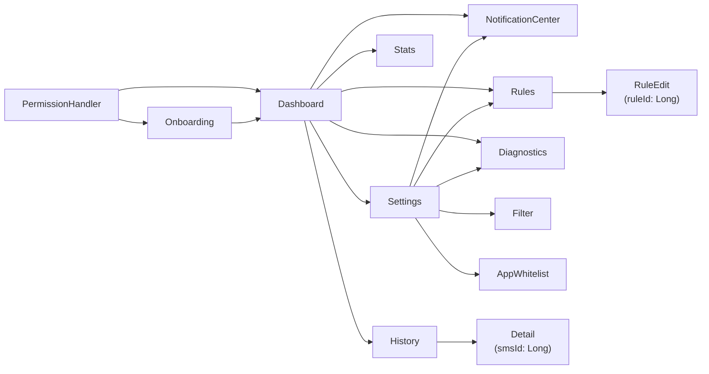
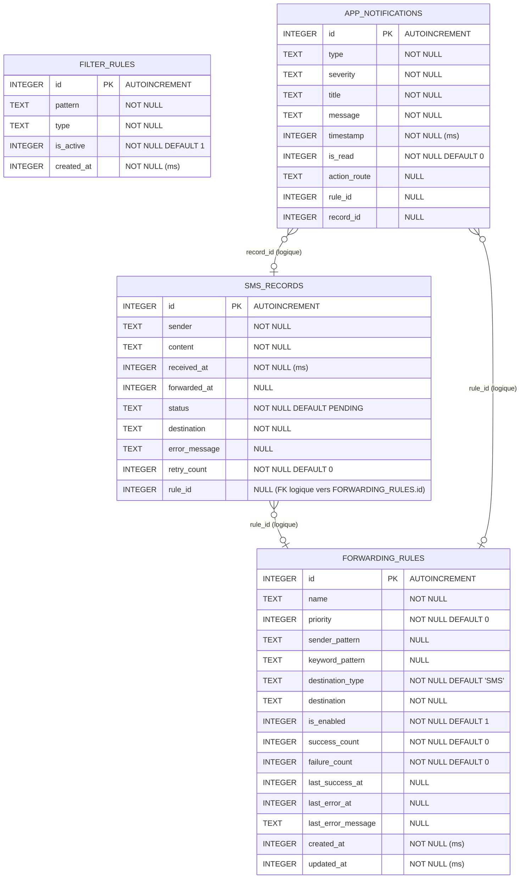

# Architecture — SMS Forwarder

🇫🇷 Français | 🇬🇧 [English](ARCHITECTURE_EN.md)

## Table des matières

- [Vue d'ensemble](#vue-densemble)
- [Diagramme d'architecture](#diagramme-darchitecture)
- [Couche Data](#couche-data)
- [Couche Domain](#couche-domain)
- [Couche Service](#couche-service)
- [Couche UI](#couche-ui)
- [Injection de dépendances (Hilt)](#injection-de-dépendances-hilt)
- [Flux de capture SMS/RCS/notifications](#flux-de-capture-smsrcsnotifications)
- [Schéma de base de données](#schéma-de-base-de-données)
- [Internationalisation (i18n)](#internationalisation-i18n)
- [Tests](#tests)
- [Décisions d'architecture](#décisions-darchitecture)
- [Gestion du lifecycle Android](#gestion-du-lifecycle-android)

---

## Vue d'ensemble

**SMS Forwarder** est une application Android qui transfère automatiquement les SMS, les messages RCS et les notifications d'applications tierces vers une destination configurable. La destination peut être un numéro de téléphone (SMS) ou un webhook HTTP (POST JSON), et peut être définie globalement ou par règle de transfert.

L'application supporte trois sources de capture (BroadcastReceiver, ContentObserver, NotificationListenerService) pour garantir la réception des messages quelle que soit l'application de messagerie utilisée. Depuis la v1.3.0, le `NotificationInterceptorService` intercepte également les notifications des applications tierces whitelistées (WhatsApp, Telegram, etc.) et les retransmet comme des messages.

| Attribut | Valeur |
|---|---|
| Package | `com.qrcommunication.smsforwarder` |
| Min SDK | 26 (Android 8.0 Oreo) |
| Target SDK | 35 |
| Compile SDK | 36 |
| Langage | Kotlin 2.0.21 |
| UI | Jetpack Compose + Material You (Material3) |
| Architecture | MVVM + Clean Architecture (Ports & Adapters pour le dispatch) |
| DI | Hilt 2.51.1 |
| Base de données | Room 2.6.1 (schéma v2) |
| i18n | FR / EN (312 chaînes) via `LocaleManager` + `attachBaseContext` |
| Tests | 185 tests unitaires |
| Version | 1.4.0 (versionCode 6) |

---

## Diagramme d'architecture


```mermaid
graph TD
    subgraph UI["Couche UI (Jetpack Compose)"]
        MA[MainActivity<br/>attachBaseContext → LocaleManager]
        NAV[AppNavigation]
        DASH[Dashboard / MainViewModel<br/>6 destinations]
        SS[SettingsScreen / SettingsViewModel]
        HS[HistoryScreen / HistoryViewModel]
        DS[DetailScreen / DetailViewModel]
        FS[FilterScreen / FilterViewModel]
        STS[StatsScreen / StatsViewModel]
        RULES[RulesScreen / RulesViewModel]
        REDIT[RuleEditScreen / RuleEditViewModel]
        NOTIF[NotificationCenterScreen / NotificationCenterViewModel]
        DIAG[DiagnosticsScreen / DiagnosticsViewModel]
        AWL[AppWhitelistScreen / AppWhitelistViewModel]
        ONB[OnboardingScreen / OnboardingViewModel]
        WGT[WidgetReceiver]
    end

    subgraph Domain["Couche Domain"]
        FWD[ForwardSmsUseCase]
        MATCH[MatchForwardingRuleUseCase]
        HIST[GetHistoryUseCase]
        STATS[GetStatsUseCase]
        FILT[ManageFiltersUseCase]
        RETRY[RetrySmsUseCase]
        EXPORT[ExportCsvUseCase]
        FE[FilterEngine]
        RP[RetryPolicy<br/>modèle configurable]
    end

    subgraph Service["Couche Service"]
        SFS[SmsForwardService<br/>Foreground Service]
        SR[SmsReceiver<br/>BroadcastReceiver]
        SCO[SmsContentObserver<br/>ContentObserver]
        NIS[NotificationInterceptorService<br/>NotificationListenerService]
        DISP[DestinationDispatcher<br/>Ports & Adapters]
        SMS[SmsSender]
        WH[WebhookSender<br/>HTTP POST JSON]
        DED[MessageDeduplicator]
        LOOP[LoopProtection]
        RMG[SmsRetryManager]
        DIAGR[DiagnosticsRunner]
        BR[BootReceiver]
    end

    subgraph Data["Couche Data"]
        SREP[SmsRepositoryImpl]
        FREP[FilterRepositoryImpl]
        FRREP[ForwardingRuleRepositoryImpl]
        ANREP[AppNotificationRepositoryImpl]
        DAO1[SmsRecordDao]
        DAO2[FilterRuleDao]
        DAO3[ForwardingRuleDao]
        DAO4[AppNotificationDao]
        DB[(AppDatabase v2<br/>Room SQLite)]
        PREF[PreferencesManager<br/>SharedPreferences]
    end

    subgraph DI["Injection de dépendances (Hilt)"]
        DM[DatabaseModule]
        RM[RepositoryModule]
    end

    MA --> NAV
    NAV --> DASH & SS & HS & DS & FS & STS & ONB & RULES & REDIT & NOTIF & DIAG & AWL
    DASH --> HIST & MATCH
    HS --> HIST
    STS --> STATS
    FS --> FILT
    DS --> HIST & RETRY
    SS --> PREF
    RULES --> FRREP
    REDIT --> FRREP
    NOTIF --> ANREP
    DIAG --> DIAGR

    MATCH --> FRREP
    FWD --> SREP & SMS & FE & LOOP & PREF
    HIST --> SREP
    STATS --> SREP
    FILT --> FREP & PREF
    RETRY --> SREP & RMG

    SFS --> SREP & DISP & DED & LOOP & MATCH & FRREP & ANREP & PREF
    SR --> SFS
    NIS --> SFS
    SCO --> SFS
    BR --> SFS
    DISP --> SMS
    DISP --> WH
    RMG --> SREP & SMS & PREF

    SREP --> DAO1
    FREP --> DAO2
    FRREP --> DAO3
    ANREP --> DAO4
    DAO1 & DAO2 & DAO3 & DAO4 --> DB

    DM --> DB & DAO1 & DAO2 & DAO3 & DAO4
    RM --> SREP & FREP & FRREP & ANREP
```

---

## Couche Data

Responsable de la persistance et de l'accès aux données. Aucune logique métier ne réside dans cette couche.

### AppDatabase

Classe Room qui déclare la base de données SQLite. Fichier : `data/local/AppDatabase.kt`.

```kotlin
@Database(
    entities = [
        SmsRecord::class,
        FilterRule::class,
        ForwardingRule::class,
        AppNotification::class,
    ],
    version = 2,
    exportSchema = false,
)
abstract class AppDatabase : RoomDatabase() {
    abstract fun smsRecordDao(): SmsRecordDao
    abstract fun filterRuleDao(): FilterRuleDao
    abstract fun forwardingRuleDao(): ForwardingRuleDao
    abstract fun appNotificationDao(): AppNotificationDao
}
```

Le nom du fichier de base de données est `sms_forwarder_db`. La migration `MIGRATION_1_2` (cf. [Schéma de base de données](#schéma-de-base-de-données)) est enregistrée dans `DatabaseModule` pour assurer la mise à jour non destructive depuis la v1.0.0.

### Entités Room

**SmsRecord** (`data/local/entity/SmsRecord.kt`) — Représente un message traité par l'application.

| Champ | Type Kotlin | Colonne SQL | Description |
|---|---|---|---|
| `id` | `Long` | `id` | Clé primaire auto-incrémentée |
| `sender` | `String` | `sender` | Numéro de l'expéditeur |
| `content` | `String` | `content` | Corps du message |
| `receivedAt` | `Long` | `received_at` | Timestamp de réception (ms) |
| `forwardedAt` | `Long?` | `forwarded_at` | Timestamp de transfert (ms, null si non envoyé) |
| `status` | `String` | `status` | Valeur de `SmsStatus` (PENDING / SENT / FAILED / FILTERED) |
| `destination` | `String` | `destination` | Numéro ou URL webhook de destination |
| `errorMessage` | `String?` | `error_message` | Message d'erreur en cas d'échec |
| `retryCount` | `Int` | `retry_count` | Nombre de tentatives effectuées |
| `ruleId` | `Long?` | `rule_id` | **v1.3.0** — Id de la `ForwardingRule` qui a déclenché le transfert (null = fallback global) |

**FilterRule** (`data/local/entity/FilterRule.kt`) — Représente une règle de filtrage (liste blanche / noire). Indépendante du routage.

| Champ | Type Kotlin | Colonne SQL | Description |
|---|---|---|---|
| `id` | `Long` | `id` | Clé primaire auto-incrémentée |
| `pattern` | `String` | `pattern` | Numéro ou mot-clé à filtrer |
| `type` | `String` | `type` | Valeur de `FilterType` |
| `isActive` | `Boolean` | `is_active` | Règle active ou désactivée |
| `createdAt` | `Long` | `created_at` | Timestamp de création (ms) |

**ForwardingRule** (`data/local/entity/ForwardingRule.kt`) — **v1.3.0**. Représente une règle de routage : associe un critère (expéditeur + mot-clé) à une destination typée (SMS ou webhook). Distincte de `FilterRule` par souci de responsabilité unique (SRP) : `FilterRule` sert au filtrage (bloquer/autoriser), `ForwardingRule` sert au routage (choisir la destination).

| Champ | Type Kotlin | Colonne SQL | Description |
|---|---|---|---|
| `id` | `Long` | `id` | Clé primaire auto-incrémentée |
| `name` | `String` | `name` | Libellé de la règle |
| `priority` | `Int` | `priority` | Priorité (ordre d'évaluation décroissant) |
| `senderPattern` | `String?` | `sender_pattern` | Regex sur l'expéditeur (null = match tous) |
| `keywordPattern` | `String?` | `keyword_pattern` | Regex/mot-clé sur le contenu (null = pas de filtre) |
| `destinationType` | `String` | `destination_type` | Valeur de `DestinationType` (SMS / WEBHOOK) |
| `destination` | `String` | `destination` | Téléphone ou URL webhook selon le type |
| `isEnabled` | `Boolean` | `is_enabled` | Règle activée ou non |
| `successCount` | `Int` | `success_count` | Compteur de transferts réussis |
| `failureCount` | `Int` | `failure_count` | Compteur d'échecs |
| `lastSuccessAt` | `Long?` | `last_success_at` | Timestamp du dernier succès |
| `lastErrorAt` | `Long?` | `last_error_at` | Timestamp de la dernière erreur |
| `lastErrorMessage` | `String?` | `last_error_message` | Dernier message d'erreur |
| `createdAt` | `Long` | `created_at` | Timestamp de création (ms) |
| `updatedAt` | `Long` | `updated_at` | Timestamp de dernière modification (ms) |

**AppNotification** (`data/local/entity/AppNotification.kt`) — **v1.3.0**. Représente une alerte in-app persistée (centre de notifications). Index composite sur `(is_read, timestamp)`.

| Champ | Type Kotlin | Colonne SQL | Description |
|---|---|---|---|
| `id` | `Long` | `id` | Clé primaire auto-incrémentée |
| `type` | `String` | `type` | Valeur de `NotificationType` |
| `severity` | `String` | `severity` | Valeur de `NotificationSeverity` |
| `title` | `String` | `title` | Titre court |
| `message` | `String` | `message` | Détail |
| `timestamp` | `Long` | `timestamp` | Timestamp (ms) |
| `isRead` | `Boolean` | `is_read` | Lu ou non |
| `actionRoute` | `String?` | `action_route` | Route de navigation optionnelle |
| `ruleId` | `Long?` | `rule_id` | Règle liée (optionnel) |
| `recordId` | `Long?` | `record_id` | `SmsRecord` lié (optionnel) |

`NotificationType` couvre : `RULE_ERROR`, `DESTINATION_UNREACHABLE`, `QUOTA_WARNING`, `RETRY_EXHAUSTED`, `PERMISSION_REVOKED`, `BATTERY_OPTIMIZATION`, `INFO`.
`NotificationSeverity` : `INFO`, `WARNING`, `ERROR`.

### DAOs

**SmsRecordDao** (`data/local/dao/SmsRecordDao.kt`) — Interface Room pour les opérations sur `sms_records`. Toutes les méthodes de lecture retournent des `Flow<>` pour l'observation réactive, à l'exception des méthodes de recherche par date et par ID qui retournent des valeurs ponctuelles.

**FilterRuleDao** (`data/local/dao/FilterRuleDao.kt`) — Interface Room pour les opérations sur `filter_rules`. `getAllRules()` et `getRulesByType()` retournent des `Flow<>`. `getActiveRules()` retourne une `List<FilterRule>` suspendue, utilisée au moment de l'évaluation d'un filtre.

**ForwardingRuleDao** (`data/local/dao/ForwardingRuleDao.kt`) — **v1.3.0**. CRUD sur `forwarding_rules`. `observeAll()` et `getEnabledOrdered()` retournent respectivement un `Flow<>` et une `List` suspendue ordonnée par `priority DESC, created_at ASC`. Expose également `recordSuccess()` et `recordFailure()` qui mettent à jour atomiquement les compteurs et timestamps de la règle.

**AppNotificationDao** (`data/local/dao/AppNotificationDao.kt`) — **v1.3.0**. CRUD sur `app_notifications`. Expose `observeAll()`, `observeUnread()` et `observeUnreadCount()` (ce dernier alimente le badge du Dashboard). Méthodes `markAsRead(id)`, `markAllAsRead()` et `deleteOlderThan(ms)` pour la maintenance.

### Repositories

Les repositories exposent des interfaces stables pour que le domain ne dépende jamais directement des DAOs Room.

| Interface | Implémentation | Rôle |
|---|---|---|
| `SmsRepository` | `SmsRepositoryImpl` | Lecture/écriture des `SmsRecord` |
| `FilterRepository` | `FilterRepositoryImpl` | Lecture/écriture des `FilterRule` |
| `ForwardingRuleRepository` | `ForwardingRuleRepositoryImpl` | **v1.3.0** — CRUD + statistiques sur les `ForwardingRule` |
| `AppNotificationRepository` | `AppNotificationRepositoryImpl` | **v1.3.0** — Centre de notifications in-app + purge |

`SmsRepositoryImpl` ajoute la logique de mise à jour partielle dans `updateStatus()` : si le statut passe à `SENT`, le champ `forwardedAt` est automatiquement renseigné avec le timestamp courant.

`ForwardingRuleRepositoryImpl` ajoute deux responsabilités :
- `upsert()` : décide insert vs update selon `id == 0L`, et renseigne `createdAt`/`updatedAt`.
- `recordSuccess()` / `recordFailure()` : délèguent au DAO qui incrémente les compteurs et met à jour les timestamps d'erreur/succès en une seule requête SQL.

`AppNotificationRepositoryImpl.notify()` construit une `AppNotification` horodatée à partir des paramètres typés et l'insère en base.

### PreferencesManager

(`data/preferences/PreferencesManager.kt`) — Singleton Hilt qui encapsule les `SharedPreferences` dans le fichier `sms_forwarder_prefs`. Stocke la configuration utilisateur non-structurée.

| Clé | Type | Valeur par défaut | Description |
|---|---|---|---|
| `destination_number` | `String` | `""` | Numéro de destination global (fallback) |
| `forwarding_enabled` | `Boolean` | `false` | Activation du transfert |
| `first_launch` | `Boolean` | `true` | Affichage de l'onboarding |
| `filter_mode` | `String` | `"NONE"` | Mode de filtrage actif |
| `sms_forwarded_count` | `Int` | `0` | Compteur de SMS transférés avec succès |
| `selected_sim_slot` | `Int` | `-1` | Slot SIM d'envoi (-1 = défaut) |
| `receiving_sim_slot` | `Int` | `-1` | Slot SIM de réception à filtrer (-1 = tous) |
| `app_whitelist_enabled` | `Boolean` | `false` | **v1.3.0** — Activation du transfert des notifications d'apps tierces |
| `app_whitelist_packages` | `Set<String>` | `emptySet()` | **v1.3.0** — Packages whitelistés (WhatsApp, Telegram…) |
| `retry_max_attempts` | `Int` | `3` | **v1.3.0** — Tentatives max (politique de retry) |
| `retry_initial_delay_ms` | `Long` | `60_000` | **v1.3.0** — Délai initial de retry (ms) |
| `retry_backoff` | `Float` | `2.0` | **v1.3.0** — Multiplicateur de backoff |
| `retry_max_delay_ms` | `Long` | `1_800_000` | **v1.3.0** — Délai maximal (ms) |
| `app_language` | `String` | `"system"` | **v1.4.0** — Langue (system / fr / en) |

La politique de retry est sérialisée en 4 clés distinctes (pas de JSON) via la propriété `retryPolicy` qui mappe vers le modèle `RetryPolicy` (cf. Couche Domain). Des helpers `addAppToWhitelist()` / `removeAppFromWhitelist()` gèrent l'ensemble des packages whitelistés.

---

## Couche Domain

Contient la logique métier pure, indépendante d'Android. Les UseCases orchestrent les interactions entre repositories et services.

### UseCases

**ForwardSmsUseCase** (`domain/usecase/ForwardSmsUseCase.kt`)

Chemin de transfert « classique » (destination globale, SMS uniquement). Séquence d'exécution :
1. Vérifie que la destination est configurée.
2. Vérifie que le transfert est activé.
3. Vérifie l'absence de boucle (`LoopProtection`).
4. Évalue les règles de filtrage (`FilterEngine`).
5. Insère un enregistrement `PENDING` (ou `FILTERED`) en base.
6. Envoie le SMS via `SmsSender`.
7. Met à jour le statut en `SENT` ou `FAILED`.

Retourne un `sealed class ForwardResult` : `Success`, `Filtered`, `Failed`, `Skipped`.

> **Note** : Le pipeline live de `SmsForwardService` utilise désormais `MatchForwardingRuleUseCase` + `DestinationDispatcher` (cf. [Flux de capture](#flux-de-capture-smsrcsnotifications)). `ForwardSmsUseCase` reste utilisé par `RetrySmsUseCase` et les tests.

**MatchForwardingRuleUseCase** (`domain/usecase/MatchForwardingRuleUseCase.kt`) — **v1.3.0**

Trouve la première `ForwardingRule` activée (par priorité décroissante) qui correspond à un message donné sur les critères expéditeur et mot-clé.

- Les patterns sont interprétés comme des **regex** insensibles à la casse (`RegexOption.IGNORE_CASE`).
- Un pattern `null` (ou vide) signifie « pas de filtre sur ce critère ».
- Une règle sans aucun pattern matche **tout**.
- En cas de regex invalide, repli sur une correspondance `contains` insensible à la casse.

Si aucune règle ne correspond, retourne `null` et le service replie sur la destination globale configurée (rétro-compatibilité v1.2.x).

**GetHistoryUseCase** (`domain/usecase/GetHistoryUseCase.kt`)

Expose des `Flow<List<SmsRecord>>` pour la liste de l'historique, avec support de la recherche full-text (sender + content), du filtrage par statut, par destination et par plage de dates (`DateRangePicker` Material3).

**GetStatsUseCase** (`domain/usecase/GetStatsUseCase.kt`)

Calcule deux types de statistiques :
- `getOverallStats()` : combine les flux Room en un `Flow<SmsStats>` avec compteurs par statut et taux de succès.
- `getDailyStats(days: Int)` : retourne une `List<DailyStats>` pour les N derniers jours, en agrégeant les enregistrements par tranche journalière.

**ManageFiltersUseCase** (`domain/usecase/ManageFiltersUseCase.kt`)

CRUD complet sur les règles de filtrage (`FilterRule`). Gère le mode de filtrage global (NONE / WHITELIST / BLACKLIST) via `PreferencesManager`. La suppression de toutes les règles remet le mode à `NONE` automatiquement.

**RetrySmsUseCase** (`domain/usecase/RetrySmsUseCase.kt`)

Réessaie l'envoi d'un enregistrement en statut `FAILED`. Vérifie que le compteur `retryCount` est inférieur au maximum autorisé par la politique de retry. Retourne un `sealed class RetryResult` : `Success`, `Failed`, `NotFound`, `MaxRetriesReached`.

**ExportCsvUseCase** (`domain/usecase/ExportCsvUseCase.kt`)

Exporte l'intégralité de l'historique en CSV (UTF-8) vers un `Uri` fourni par le sélecteur de fichiers Android ou vers un fichier interne. Les guillemets dans le contenu sont échappés selon la RFC CSV.

### RetryPolicy

(`domain/model/RetryPolicy.kt`) — **v1.3.0**. Modèle de domaine qui encapsule la politique de retry configurable par l'utilisateur.

```kotlin
data class RetryPolicy(
    val maxAttempts: Int = DEFAULT_MAX_ATTEMPTS,        // 3
    val initialDelayMs: Long = DEFAULT_INITIAL_DELAY_MS, // 60 000 ms
    val backoffMultiplier: Double = DEFAULT_BACKOFF,     // 2.0
    val maxDelayMs: Long = DEFAULT_MAX_DELAY_MS,         // 30 min
)
```

Backoff exponentiel : `delay(n) = min(initialDelayMs * backoffMultiplier^n, maxDelayMs)`, où `n` est l'index de tentative (0 = premier retry). `shouldRetry(currentAttempt)` retourne `true` tant que `currentAttempt < maxAttempts`. Sérialisée en 4 clés distinctes dans `PreferencesManager`.

### FilterEngine

(`domain/validator/FilterEngine.kt`) — Évalue si un message doit être transféré selon le mode actif et les règles `FilterRule` configurées.

**Modes** (enum `FilterMode`) :
- `NONE` : tout message est transféré.
- `WHITELIST` : seuls les messages correspondant à une règle WHITELIST active sont transférés.
- `BLACKLIST` : les messages correspondant à une règle BLACKLIST active sont bloqués.

**Logique de correspondance** dans `matchesRule()` :
1. Si le pattern est un numéro de téléphone valide : comparaison après normalisation E.164.
2. Sinon : recherche insensible à la casse dans le numéro d'expéditeur et le corps du message.

### Utilitaires

**PhoneValidator** (`util/PhoneValidator.kt`) — Valide et normalise les numéros de téléphone. Accepte les formats E.164 (`+33XXXXXXXXX`), local français (`0XXXXXXXXX`) et international avec préfixe double zéro (`0033XXXXXXXXX`). La méthode `normalize()` convertit tout format vers E.164.

**SmsFormatter** (`util/SmsFormatter.kt`) — Formate le message transféré SMS selon le template `[De: {sender} | {date}] {content}` (avec `sourceLabel` optionnel pour les apps tierces). Calcule également le nombre de parties SMS pour les messages longs (seuil : 153 caractères par partie en multipart).

**DateFormatter** (`util/DateFormatter.kt`) — Formatage des timestamps en formats lisibles (court, long, relatif, CSV).

**DiagnosticsRunner** (`util/DiagnosticsRunner.kt`) — **v1.3.0**. Audite l'environnement OS en lecture seule pour identifier les blocages potentiels du transfert : permissions (RECEIVE_SMS, SEND_SMS, READ_SMS, READ_PHONE_STATE, POST_NOTIFICATIONS), accès au NotificationListenerService, exception d'optimisation batterie, connectivité réseau. Chaque `DiagnosticCheck` expose un `fixIntent` optionnel (Intent vers les paramètres système adapté) que l'UI peut lancer. Sans side-effect.

**LocaleManager** (`util/LocaleManager.kt`) — **v1.4.0**. Cf. [Internationalisation](#internationalisation-i18n).

---

## Couche Service

Contient les composants Android qui opèrent en arrière-plan. Cette couche est découplée du UI et interagit directement avec la couche Data et Domain.

### SmsForwardService

(`service/SmsForwardService.kt`) — Foreground Service principal. Point d'entrée de tous les messages à traiter.

Cycle de vie :
- `onCreate()` : lance la notification persistante, instancie et enregistre le `SmsContentObserver`.
- `onStartCommand()` : traite les actions `ACTION_FORWARD_SMS` (transfert d'un message) et `ACTION_STOP_SERVICE` (arrêt propre). L'action `ACTION_FORWARD_SMS` supporte un extra `EXTRA_APP_LABEL` pour les messages issus d'apps tierces.
- `onDestroy()` : annule le `CoroutineScope` (superviseur), désenregistre le `SmsContentObserver`.

Le service utilise `START_STICKY` pour être relancé par Android après un kill système. Sur Android 14+ (API 34), il déclare `FOREGROUND_SERVICE_TYPE_SPECIAL_USE`.

Le traitement effectif de chaque message dans `handleForwardSms()` (pipeline v1.3.0+) :
1. Appel à `MessageDeduplicator.shouldProcess()` — abandon si doublon.
2. Filtre SIM de réception (`passesSimFilter`) — ignoré pour les messages d'apps tierces (`appLabel != null`).
3. Vérification de l'état d'activation.
4. **`MatchForwardingRuleUseCase`** : trouve la règle de routage correspondante. En l'absence de règle, fallback sur la destination globale (type SMS).
5. **Loop protection** : uniquement pour les destinations SMS (un webhook ne peut pas créer de SMS).
6. Insertion en base `PENDING` avec `ruleId` renseigné si une règle a matché.
7. Construction d'un `MessagePayload` et appel à **`DestinationDispatcher.dispatch()`**.
8. Mise à jour du statut en `SENT` (incrément du compteur + `recordSuccess` sur la règle) ou `FAILED` (`recordFailure` + publication d'une `AppNotification` d'erreur).

### SmsReceiver

(`receiver/SmsReceiver.kt`) — `BroadcastReceiver` déclaré avec la priorité 999 pour l'action `android.provider.Telephony.SMS_RECEIVED`. Délègue immédiatement au `SmsForwardService` via `startForegroundService()`.

### SmsContentObserver

(`service/SmsContentObserver.kt`) — Observe `content://sms/inbox` pour capturer les messages qui n'arrivent pas via `SMS_RECEIVED` (RCS gérés par certaines applications, Samsung Messages). Mémorise le dernier ID traité pour ne requêter que les nouveaux enregistrements à chaque déclenchement de `onChange()`.

### NotificationInterceptorService

(`service/NotificationInterceptorService.kt`) — `NotificationListenerService` qui joue un double rôle :

1. **Messagerie native (RCS)** : intercepte les notifications postées par les applications de messagerie connues :
   - `com.google.android.apps.messaging` (Google Messages)
   - `com.samsung.android.messaging` (Samsung Messages)
   - `com.android.mms` (AOSP Messages)

   Filtre les notifications groupées (summaries) et les notifications `ONGOING`. Extrait expéditeur + contenu et les relaie au `SmsForwardService`.

2. **Apps tierces (v1.3.0)** : si la **whitelist d'apps** est activée (`isAppWhitelistEnabled`) et que le package émetteur figure dans `appWhitelistPackages`, la notification est capturée, formatée (`"{appLabel}: {title} — {content}"`) et retransmise avec `EXTRA_APP_LABEL` renseigné. Couvre WhatsApp, Telegram, Allo, Ringover, Onoff, etc.

### DestinationDispatcher

(`service/sender/DestinationDispatcher.kt`) — **v1.3.0**. Routeur central implémentant le pattern **Ports & Adapters** (hexagonal). Responsabilité unique (SRP) : aucune logique de filtrage ou de matching, uniquement la sélection du canal d'envoi selon le type de destination.

```kotlin
suspend fun dispatch(type: DestinationType, destination: String, payload: MessagePayload) {
    when (type) {
        DestinationType.SMS    -> smsSender.sendSms(destination, SmsFormatter.format(...))
        DestinationType.WEBHOOK -> webhookSender.send(destination, payload)
    }
}
```

Reçoit un `MessagePayload` neutre (indépendant du canal) et délègue à l'adaptateur approprié. L'ajout d'un nouveau canal (push, e-mail…) consisterait à ajouter un adapter et une branche au `when`.

### WebhookSender

(`service/sender/WebhookSender.kt`) — **v1.3.0**. Adaptateur HTTP qui envoie un message via `POST` JSON vers une URL webhook. Implémentation sans dépendance externe (`HttpURLConnection`).

Payload envoyé :
```json
{
  "sender": "...",
  "content": "...",
  "receivedAt": 1718956800000,
  "sourceLabel": "WhatsApp",
  "originalDestination": "+33..."
}
```

Timeouts : connexion 10 s, lecture 15 s. `User-Agent: SMSForwarder-Android/1.0`. Lève une `WebhookException` (code HTTP ≥ 400 ou erreur réseau), interceptée par `SmsForwardService` pour marquer l'enregistrement `FAILED`.

### SmsSender

(`service/SmsSender.kt`) — Encapsule l'envoi SMS via `SmsManager`. Gère les messages longs (> 160 caractères) en multipart. Sélectionne le `SmsManager` approprié selon le slot SIM configuré (API 31+ via `SubscriptionManager`). Depuis la v1.3.0, utilise `getSystemService(SmsManager).createForSubscriptionId()` au lieu de l'API dépréciée `SmsManager.getDefault()`.

### MessagePayload

(`service/sender/MessagePayload.kt`) — **v1.3.0**. DTO neutre passé au dispatcher, indépendant du canal de destination : `sender`, `content`, `receivedAt`, `sourceLabel?` (label de l'app tierce), `originalDestination?`.

### MessageDeduplicator

(`service/MessageDeduplicator.kt`) — Prévient le traitement multiple d'un même message capturé par plusieurs sources simultanément. Le hash est calculé sur `sender + content(100 chars) + timestamp arrondi à 5 secondes`. Le cache est limité à 500 entrées et les entrées expirent après 60 secondes.

### LoopProtection

(`service/LoopProtection.kt`) — Détecte les boucles de transfert en deux étapes :
1. Comparaison directe sender == destination (après normalisation).
2. Comparaison destination == numéro SIM local (lecture via `SubscriptionManager.getPhoneNumber(subId)` sur API 33+, avec fallback `TelephonyManager.line1Number` en dessous).

La normalisation convertit tout format français en E.164 (`+33XXXXXXXXX`). Remarque : la boucle n'est vérifiée que pour les destinations SMS.

### SmsRetryManager

(`service/SmsRetryManager.kt`) — Gère la logique de ré-essai avec backoff exponentiel. Depuis la v1.3.0, la politique est **configurable** via le modèle `RetryPolicy` persisté dans `PreferencesManager` (tentatives max, délai initial, multiplicateur de backoff, délai maximal). Expose `retryAllFailed()` pour relancer tous les enregistrements en échec éligibles.

### BootReceiver

(`receiver/BootReceiver.kt`) — Écoute `BOOT_COMPLETED` et `QUICKBOOT_POWERON` (constructeurs HTC/Huawei). Relit les `SharedPreferences` directement (sans Hilt, car les BroadcastReceivers non-Hilt n'ont pas d'injection) pour vérifier si le transfert était actif avant le redémarrage.

### NotificationHelper

(`service/NotificationHelper.kt`) — Singleton qui crée et met à jour les notifications via deux canaux :
- `sms_forwarding_channel` : notification persistante du Foreground Service (priorité LOW).
- `sms_status_channel` : notifications ponctuelles de transfert réussi (priorité DEFAULT).

---

## Couche UI

Implémentée entièrement en Jetpack Compose. Chaque écran suit le pattern MVVM : un `@Composable` observe un `StateFlow<UiState>` exposé par un `@HiltViewModel`. Depuis la v1.4.0, 100 % des chaînes sont localisées via `stringResource()` / `context.getString()`.

### Écrans

| Écran | Fichier | ViewModel | Description |
|---|---|---|---|
| Onboarding | `OnboardingScreen.kt` | `OnboardingViewModel` | Onboarding multi-étapes (4 pages : welcome, permissions, destination, test SMS) |
| **Dashboard** (ex-Main) | `MainScreen.kt` | `MainViewModel` | Tableau de bord temps réel : toggle, stats 24h, badge notifications, 6 destinations de navigation |
| Settings | `SettingsScreen.kt` | `SettingsViewModel` | Configuration destination, filtre, SIM, whitelist d'apps, retry policy, langue |
| History | `HistoryScreen.kt` | `HistoryViewModel` | Liste des transferts avec recherche, filtre par statut/destination/plage de dates, bouton Renvoyer |
| Detail | `DetailScreen.kt` | `DetailViewModel` | Détail d'un transfert individuel avec retransmission |
| Filter | `FilterScreen.kt` | `FilterViewModel` | Gestion des règles de filtrage (FilterRule) |
| **Rules** | `RulesScreen.kt` | `RulesViewModel` | **v1.3.0** — Liste CRUD des règles de transfert (ForwardingRule) avec activation/désactivation |
| **RuleEdit** | `RuleEditScreen.kt` | `RuleEditViewModel` | **v1.3.0** — Édition/création d'une règle (regex expéditeur, mot-clé, destination typée, priorité) + test interactif |
| **NotificationCenter** | `NotificationCenterScreen.kt` | `NotificationCenterViewModel` | **v1.3.0** — Centre de notifications in-app (mark-read individuel/global, suppression) |
| **Diagnostics** | `DiagnosticsScreen.kt` | `DiagnosticsViewModel` | **v1.3.0** — Audit permissions/batterie/réseau avec Intent de correction |
| **AppWhitelist** | `AppWhitelistScreen.kt` | `AppWhitelistViewModel` | **v1.3.0** — Sélection des apps tierces dont les notifications sont transférées |
| Stats | `StatsScreen.kt` | `StatsViewModel` | Statistiques globales et graphique journalier |

### Navigation

(`ui/navigation/AppNavigation.kt` + `ui/navigation/Screen.kt`)

Navigation pilotée par `NavHostController`. Au démarrage, `PermissionHandler` vérifie les permissions avant d'afficher l'interface. La destination initiale est `Screen.Onboarding` si `isFirstLaunch == true`, sinon `Screen.Main` (Dashboard).


```mermaid
graph LR
    PERM[PermissionHandler] --> ONB[Onboarding]
    PERM --> DASH[Dashboard]
    ONB --> DASH
    DASH --> NOTIF[NotificationCenter]
    DASH --> RULES[Rules]
    DASH --> HISTORY[History]
    DASH --> DIAG[Diagnostics]
    DASH --> STATS[Stats]
    DASH --> SETTINGS[Settings]
    SETTINGS --> FILTER[Filter]
    SETTINGS --> AWL[AppWhitelist]
    SETTINGS --> RULES
    SETTINGS --> DIAG
    SETTINGS --> NOTIF
    RULES --> REDIT["RuleEdit<br/>(ruleId: Long)"]
    HISTORY --> DETAIL["Detail<br/>(smsId: Long)"]
```

Le Dashboard expose 6 cibles de navigation (Notifications, Règles, Historique, Diagnostics, Stats, Réglages). `Screen` est une `sealed class` avec `Detail(smsId)` et `RuleEdit(ruleId)` paramétrés.

### Composants partagés

Depuis la v1.3.0, les composants UI factorisés (DRY) vivent dans `ui/components/common/` et sont partagés entre tous les écrans.

| Composant | Fichier | Usage |
|---|---|---|
| `PermissionHandler` | `ui/components/PermissionHandler.kt` | Demande les permissions requises au démarrage |
| `PhoneNumberField` | `ui/components/PhoneNumberField.kt` | Champ de saisie avec validation en temps réel |
| `SmsListItem` | `ui/components/SmsListItem.kt` | Élément de liste dans l'historique |
| `StatusBadge` | `ui/components/StatusBadge.kt` | Badge coloré par statut (SENT, FAILED, etc.) |
| `ExportButton` | `ui/components/ExportButton.kt` | Bouton d'export CSV |
| `SettingsCard` | `ui/components/common/SettingsCard.kt` | **v1.3.0** — Carte de section paramètres |
| `SectionHeader` | `ui/components/common/SectionHeader.kt` | **v1.3.0** — En-tête de section |
| `EmptyState` | `ui/components/common/EmptyState.kt` | **v1.3.0** — État vide (illustration + message) |
| `StatTile` | `ui/components/common/StatTile.kt` | **v1.3.0** — Tuile de statistique (Dashboard) |
| `ConfigOption` | `ui/components/common/ConfigOption.kt` | **v1.3.0** — Ligne d'option cliquable |
| `StatusItem` | `ui/components/common/StatusItem.kt` | **v1.3.0** — Ligne de statut (OK/WARNING/ERROR, Diagnostics) |

### Thème

(`ui/theme/`) — Thème Material You (Material3) avec support du Dynamic Color. Les couleurs de référence sont définies dans `Color.kt`, la typographie dans `Type.kt`, et le thème global dans `Theme.kt`. L'Activity utilise `enableEdgeToEdge()` + `WindowCompat.setDecorFitsSystemWindows` (l'API dépréciée `window.statusBarColor` a été retirée en v1.3.0).

### Widget

(`ui/widget/WidgetReceiver.kt`) — `AppWidgetProvider` qui affiche l'état du service (ON/OFF) et le compteur de SMS. Le bouton de toggle démarre ou arrête le `SmsForwardService` directement depuis le widget sans ouvrir l'application.

---

## Injection de dépendances (Hilt)

Deux modules Hilt déclarés dans `di/` :

**DatabaseModule** — Installé dans `SingletonComponent`. Fournit `AppDatabase` (singleton Room construit avec `addMigrations(MIGRATION_1_2)`), ainsi que les 4 DAOs : `SmsRecordDao`, `FilterRuleDao`, `ForwardingRuleDao`, `AppNotificationDao`.

**RepositoryModule** — Installé dans `SingletonComponent`. Lie les interfaces aux implémentations avec `@Binds @Singleton` :
- `SmsRepository` → `SmsRepositoryImpl`
- `FilterRepository` → `FilterRepositoryImpl`
- `ForwardingRuleRepository` → `ForwardingRuleRepositoryImpl`
- `AppNotificationRepository` → `AppNotificationRepositoryImpl`

Les services (`SmsSender`, `WebhookSender`, `DestinationDispatcher`, `MessageDeduplicator`, `LoopProtection`, `SmsRetryManager`, `NotificationHelper`, `PreferencesManager`, `FilterEngine`, `DiagnosticsRunner`) sont des singletons injectés via `@Singleton` + `@Inject constructor`.

Les UseCases (`ForwardSmsUseCase`, `MatchForwardingRuleUseCase`, `RetrySmsUseCase`, etc.) sont injectés via `@Inject constructor` (sans scope, instanciés à la demande).

`SmsForwardService` et `NotificationInterceptorService` sont annotés `@AndroidEntryPoint` pour permettre l'injection de membres avec `@Inject lateinit var`.

---

## Flux de capture SMS/RCS/notifications

Le pipeline v1.3.0+ introduit deux étapes clés après la déduplication : le **matching de règle** (`MatchForwardingRuleUseCase`) puis le **dispatch** (`DestinationDispatcher`) qui route vers SMS ou webhook.

```mermaid
sequenceDiagram
    participant SRC as Source (Réseau / App tierce)
    participant SR as SmsReceiver
    participant SCO as SmsContentObserver
    participant NIS as NotificationInterceptorService
    participant SFS as SmsForwardService
    participant DED as MessageDeduplicator
    participant MATCH as MatchForwardingRuleUseCase
    participant LOOP as LoopProtection
    participant DISP as DestinationDispatcher
    participant DB as Room (SmsRecord)
    participant FRDB as Room (ForwardingRule)
    participant ANDB as Room (AppNotification)

    SRC->>SR: SMS_RECEIVED broadcast
    SRC->>SCO: onChange() content://sms/inbox
    SRC->>NIS: onNotificationPosted() (RCS / app tierce)

    SR->>SFS: startForegroundService(ACTION_FORWARD_SMS)
    SCO->>SFS: callback onNewMessage()
    NIS->>SFS: startForegroundService(ACTION_FORWARD_SMS)

    SFS->>DED: shouldProcess(sender, content, ts)?
    alt Doublon détecté
        DED-->>SFS: false → abandon
    else Nouveau message
        DED-->>SFS: true
        SFS->>MATCH: invoke(sender, content)
        alt Une règle match
            MATCH-->>SFS: ForwardingRule (destination + type)
        else Aucune règle
            MATCH-->>SFS: null → fallback destination globale (SMS)
        end
        opt Destination de type SMS
            SFS->>LOOP: isLoopDetected(sender, dest)?
            alt Boucle détectée
                LOOP-->>SFS: true → abandon
            end
        end
        SFS->>DB: INSERT SmsRecord(PENDING, ruleId?)
        SFS->>DISP: dispatch(type, destination, payload)
        alt Succès
            DISP-->>SFS: OK
            SFS->>DB: UPDATE status=SENT
            opt Règle liée
                SFS->>FRDB: recordSuccess(ruleId)
            end
        else Échec
            DISP-->>SFS: Exception
            SFS->>DB: UPDATE status=FAILED
            opt Règle liée
                SFS->>FRDB: recordFailure(ruleId, error)
            end
            SFS->>ANDB: notify(RULE_ERROR / DESTINATION_UNREACHABLE)
        end
    end
```

Le `MessageDeduplicator` garantit qu'un message capturé par plusieurs sources simultanément n'est traité qu'une seule fois.

---

## Schéma de base de données

La base de données est en **version 2** depuis la v1.3.0. La migration `MIGRATION_1_2` (`data/local/migrations/Migrations.kt`) est non destructive : elle ajoute la colonne `rule_id` à `sms_records` et crée les tables `forwarding_rules` et `app_notifications` (avec l'index sur `app_notifications(is_read, timestamp)`).


```mermaid
erDiagram
    SMS_RECORDS {
        INTEGER id PK "AUTOINCREMENT"
        TEXT sender "NOT NULL"
        TEXT content "NOT NULL"
        INTEGER received_at "NOT NULL (ms)"
        INTEGER forwarded_at "NULL"
        TEXT status "NOT NULL DEFAULT PENDING"
        TEXT destination "NOT NULL"
        TEXT error_message "NULL"
        INTEGER retry_count "NOT NULL DEFAULT 0"
        INTEGER rule_id "NULL (FK logique vers FORWARDING_RULES.id)"
    }

    FILTER_RULES {
        INTEGER id PK "AUTOINCREMENT"
        TEXT pattern "NOT NULL"
        TEXT type "NOT NULL"
        INTEGER is_active "NOT NULL DEFAULT 1"
        INTEGER created_at "NOT NULL (ms)"
    }

    FORWARDING_RULES {
        INTEGER id PK "AUTOINCREMENT"
        TEXT name "NOT NULL"
        INTEGER priority "NOT NULL DEFAULT 0"
        TEXT sender_pattern "NULL"
        TEXT keyword_pattern "NULL"
        TEXT destination_type "NOT NULL DEFAULT 'SMS'"
        TEXT destination "NOT NULL"
        INTEGER is_enabled "NOT NULL DEFAULT 1"
        INTEGER success_count "NOT NULL DEFAULT 0"
        INTEGER failure_count "NOT NULL DEFAULT 0"
        INTEGER last_success_at "NULL"
        INTEGER last_error_at "NULL"
        TEXT last_error_message "NULL"
        INTEGER created_at "NOT NULL (ms)"
        INTEGER updated_at "NOT NULL (ms)"
    }

    APP_NOTIFICATIONS {
        INTEGER id PK "AUTOINCREMENT"
        TEXT type "NOT NULL"
        TEXT severity "NOT NULL"
        TEXT title "NOT NULL"
        TEXT message "NOT NULL"
        INTEGER timestamp "NOT NULL (ms)"
        INTEGER is_read "NOT NULL DEFAULT 0"
        TEXT action_route "NULL"
        INTEGER rule_id "NULL"
        INTEGER record_id "NULL"
    }

    SMS_RECORDS }o--o| FORWARDING_RULES : "rule_id (logique)"
    APP_NOTIFICATIONS }o--o| FORWARDING_RULES : "rule_id (logique)"
    APP_NOTIFICATIONS }o--o| SMS_RECORDS : "record_id (logique)"
```

Il n'existe pas de contrainte de clé étrangère SQL déclarée : `SMS_RECORDS.rule_id`, `APP_NOTIFICATIONS.rule_id` et `APP_NOTIFICATIONS.record_id` sont des références **logiques** (liaison applicative, non contraintes par Room). Les quatre tables sont par ailleurs indépendantes au niveau du schéma.

---

## Internationalisation (i18n)

**v1.4.0** — L'application est entièrement traduite en français et anglais (312 chaînes).

**LocaleManager** (`util/LocaleManager.kt`) — Gestionnaire centralisé de locale :
- `resolveLanguage(pref)` : `"system"` se résout en `fr` si l'appareil est en français, sinon `en` ; `fr`/`en` sont des overrides explicites.
- `applyLocale(context)` : applique la locale sauvegardée en lisant directement `sms_forwarder_prefs` (sans Hilt), appelé depuis `MainActivity.attachBaseContext()` **avant** `onCreate` pour que la configuration soit effective dès la première inflation des ressources.
- `setLanguage(context, code)` : persiste la préférence ; l'appelant doit ensuite `recreate()` l'Activity.

**Ressources** : `values/strings.xml` est l'Anglais (défaut/fallback), `values-fr/` le Français, `values-en/` l'Anglais explicite. Le sélecteur de langue (Système / Français / English) vit dans `SettingsScreen` et déclenche `activity.recreate()` au changement.

---

## Tests

L'application compte **185 tests unitaires** (vs 107 en v1.0.0), répartis sur les utilitaires, les UseCases, les ViewModels, les services et les repositories. Les nouveaux modules (v1.3.0/v1.4.0) couvrent notamment :

- `MatchForwardingRuleUseCaseTest` — matching regex, priorité, fallback.
- `RetryPolicyTest` — calcul de backoff exponentiel, plafonnement, `shouldRetry`.
- `DestinationDispatcherTest` — routage SMS vs webhook.
- `WebhookSenderTest` — serveur HTTP local, codes d'erreur, timeout.
- `DiagnosticsRunnerTest` — checks permissions/batterie/réseau (Robolectric).
- `ForwardingRuleRepositoryImplTest` / `AppNotificationRepositoryImplTest` — DAOs Room in-memory.
- `RulesViewModelTest` / `RuleEditViewModelTest` / `NotificationCenterViewModelTest` — nouveaux écrans.
- `PreferencesManagerTest` — nouvelles clés (retry policy, langue, whitelist).

Configuration : `unitTests.isReturnDefaultValues = true` (évite les `RuntimeException` en JVM), Mockito-Kotlin 5.4.0, Robolectric pour les composants dépendant du framework Android.

---

## Décisions d'architecture

### Pourquoi MVVM

Le pattern MVVM est le standard recommandé par Google pour les applications Android modernes avec Jetpack Compose. Le `ViewModel` survit aux rotations d'écran et centralise l'état UI via `StateFlow`, ce qui simplifie le cycle de vie des composables.

### Pourquoi Hilt

Hilt est le framework DI officiel Android, construit sur Dagger 2. Il intègre nativement le cycle de vie Android (Activity, Fragment, Service, ViewModel), ce qui élimine le boilerplate d'initialisation. L'alternative Koin a été écartée pour la robustesse de la vérification à la compilation.

### Pourquoi Room

Room est l'ORM recommandé par Google pour SQLite sur Android. L'intégration native avec les `Flow` Kotlin Coroutines permet l'observation réactive de la base de données sans couche supplémentaire. L'alternative Realm a été écartée pour limiter les dépendances externes.

### Pourquoi deux entités de règles (FilterRule vs ForwardingRule)

En v1.3.0, l'entité `FilterRule` (filtrage : bloquer/autoriser) a été distinguée de `ForwardingRule` (routage : choisir la destination et son type) par souci de **responsabilité unique (SRP)**. Mélanger les deux responsabilités dans une seule table aurait rendu la logique de filtrage et de routage difficile à faire évoluer indépendamment.

### Pourquoi Ports & Adapters pour DestinationDispatcher

`DestinationDispatcher` implémente le pattern **hexagonal** : il expose un port unique (`dispatch(type, destination, payload)`) et délègue à des adaptateurs (`SmsSender`, `WebhookSender`). La logique métier de routage est ainsi isolée des détails d'envoi. L'ajout d'un nouveau canal de destination (push, e-mail, MQTT…) se limite à un nouvel adaptateur et une branche `when`, sans impacter le service ou les UseCases.

### Pourquoi ContentObserver pour les RCS

Les messages RCS ne déclenchent pas le broadcast `SMS_RECEIVED`. Deux mécanismes complémentaires couvrent ce cas :
- `SmsContentObserver` observe `content://sms/inbox` : fonctionne quand l'application de messagerie stocke les RCS dans le provider SMS standard (Google Messages sur certains appareils).
- `NotificationInterceptorService` intercepte les notifications des applications de messagerie : couvre les cas où les RCS ne sont pas dans le provider SMS, ainsi que les apps tierces whitelistées (v1.3.0).

Le `MessageDeduplicator` garantit qu'un message capturé par plusieurs sources simultanément n'est traité qu'une seule fois.

### Pourquoi un Foreground Service

Un service en arrière-plan classique peut être tué par Android en situation de mémoire faible ou lors de l'entrée en Doze mode. Le Foreground Service avec une notification persistante est la seule approche fiable pour maintenir le traitement actif en permanence, conformément aux exigences de l'application.

### Pourquoi LocaleManager via attachBaseContext

La locale doit être appliquée **avant** que l'Activity n'inflate ses ressources, sinon les chaînes de la première frame sont dans la langue système. `attachBaseContext()` est le seul hook garanti assez tôt dans le cycle de vie. Comme les BroadcastReceivers n'ont pas accès à Hilt, `LocaleManager` lit directement `SharedPreferences`.

---

## Gestion du lifecycle Android

### Foreground Service et restrictions

`SmsForwardService` s'exécute en tant que `FOREGROUND_SERVICE_TYPE_SPECIAL_USE` (API 34+) ou sans type explicite sur les versions antérieures. La notification persistante est requise par Android et affiche le numéro de destination et le compteur de SMS.

Le service utilise un `CoroutineScope(SupervisorJob() + Dispatchers.IO)` propre. Le `SupervisorJob` isole les échecs : une exception dans le traitement d'un message ne tue pas le scope global.

### Doze mode et App Standby

En Doze mode, les broadcasts sont différés sauf pour les actions prioritaires. `SMS_RECEIVED` est une action exemptée du Doze (broadcast à haute priorité). La notification du Foreground Service maintient l'application dans le bucket "active". L'écran **Diagnostics** (v1.3.0) permet à l'utilisateur de vérifier l'exception d'optimisation batterie et d'en demander l'octroi en un tap.

### Redémarrage après reboot

`BootReceiver` écoute `BOOT_COMPLETED` et `QUICKBOOT_POWERON`. Comme les BroadcastReceivers standard n'ont pas accès à l'injection Hilt, il lit directement les `SharedPreferences` pour déterminer si le service doit être relancé. Le toggle d'activation dans les préférences est la source de vérité.

### Multi-SIM (API 31+)

`SmsSender` utilise `SubscriptionManager` pour sélectionner le SIM à utiliser selon `preferencesManager.selectedSimSlot`. Depuis la v1.3.0, la sélection utilise `getSystemService(SmsManager).createForSubscriptionId()` (API dépréciée `SmsManager.getDefault()` retirée) et la lecture du numéro local passe par `SubscriptionManager.getPhoneNumber(subId)` sur API 33+ (avec fallback `TelephonyManager.line1Number` en dessous). Le slot SIM de réception peut également être filtré via `receiving_sim_slot`.
