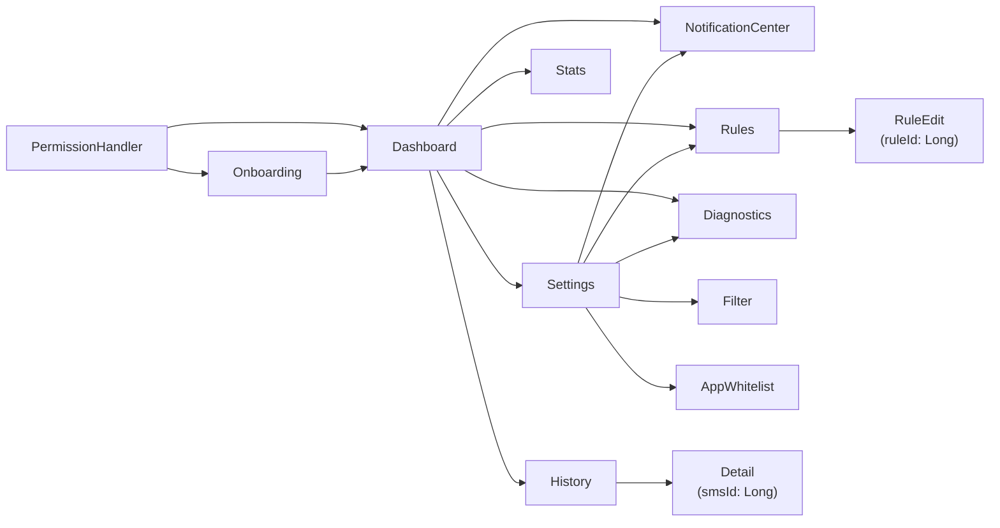
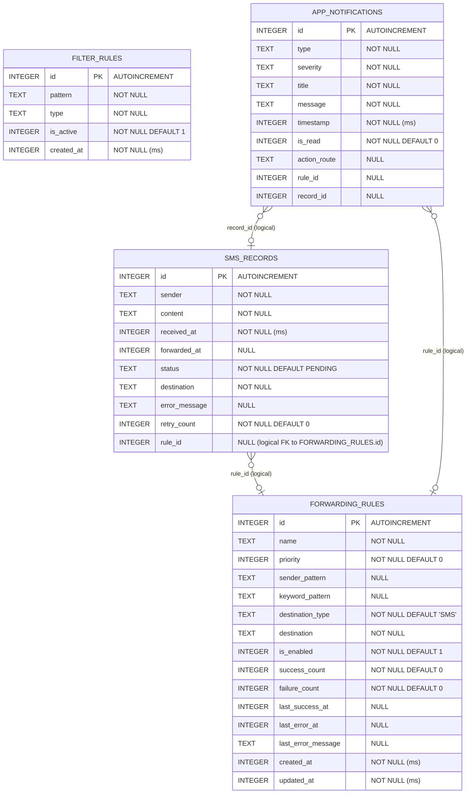

# Architecture — SMS Forwarder

🇫🇷 [Français](ARCHITECTURE.md) | 🇬🇧 English

## Table of contents

- [Overview](#overview)
- [Architecture diagram](#architecture-diagram)
- [Data layer](#data-layer)
- [Domain layer](#domain-layer)
- [Service layer](#service-layer)
- [UI layer](#ui-layer)
- [Dependency injection (Hilt)](#dependency-injection-hilt)
- [SMS/RCS/notifications capture flow](#smsrcsnotifications-capture-flow)
- [Database schema](#database-schema)
- [Internationalization (i18n)](#internationalization-i18n)
- [Tests](#tests)
- [Architecture decisions](#architecture-decisions)
- [Android lifecycle management](#android-lifecycle-management)

---

## Overview

**SMS Forwarder** is an Android application that automatically forwards SMS, RCS messages and third-party app notifications to a configurable destination. The destination can be a phone number (SMS) or an HTTP webhook (JSON POST), and can be set globally or per forwarding rule.

The application supports three capture sources (BroadcastReceiver, ContentObserver, NotificationListenerService) to guarantee message reception regardless of the messaging app used. Since v1.3.0, the `NotificationInterceptorService` also intercepts notifications from whitelisted third-party apps (WhatsApp, Telegram, etc.) and retransmits them as messages.

| Attribute | Value |
|---|---|
| Package | `com.qr_communication.smsforwarder` |
| Min SDK | 26 (Android 8.0 Oreo) |
| Target SDK | 35 |
| Compile SDK | 36 |
| Language | Kotlin 2.0.21 |
| UI | Jetpack Compose + Material You (Material3) |
| Architecture | MVVM + Clean Architecture (Ports & Adapters for dispatch) |
| DI | Hilt 2.51.1 |
| Database | Room 2.6.1 (schema v2) |
| i18n | FR / EN (312 strings) via `LocaleManager` + `attachBaseContext` |
| Tests | 185 unit tests |
| Version | 1.4.0 (versionCode 6) |

---

## Architecture diagram

```mermaid
graph TD
    subgraph UI["UI layer (Jetpack Compose)"]
        MA[MainActivity<br/>attachBaseContext → LocaleManager]
        NAV[AppNavigation]
        DASH[Dashboard / MainViewModel<br/>6 destinations]
        SS[SettingsScreen / SettingsViewModel]
        HS[HistoryScreen / HistoryViewModel]
        DS[DetailScreen / DetailViewModel]
        FS[FilterScreen / FilterViewModel]
        STS[StatsScreen / StatsViewModel]
        RULES[RulesScreen / RulesViewModel]
        REDIT[RuleEditScreen / RuleEditViewModel]
        NOTIF[NotificationCenterScreen / NotificationCenterViewModel]
        DIAG[DiagnosticsScreen / DiagnosticsViewModel]
        AWL[AppWhitelistScreen / AppWhitelistViewModel]
        ONB[OnboardingScreen / OnboardingViewModel]
        WGT[WidgetReceiver]
    end

    subgraph Domain["Domain layer"]
        FWD[ForwardSmsUseCase]
        MATCH[MatchForwardingRuleUseCase]
        HIST[GetHistoryUseCase]
        STATS[GetStatsUseCase]
        FILT[ManageFiltersUseCase]
        RETRY[RetrySmsUseCase]
        EXPORT[ExportCsvUseCase]
        FE[FilterEngine]
        RP[RetryPolicy<br/>configurable model]
    end

    subgraph Service["Service layer"]
        SFS[SmsForwardService<br/>Foreground Service]
        SR[SmsReceiver<br/>BroadcastReceiver]
        SCO[SmsContentObserver<br/>ContentObserver]
        NIS[NotificationInterceptorService<br/>NotificationListenerService]
        DISP[DestinationDispatcher<br/>Ports & Adapters]
        SMS[SmsSender]
        WH[WebhookSender<br/>HTTP POST JSON]
        DED[MessageDeduplicator]
        LOOP[LoopProtection]
        RMG[SmsRetryManager]
        DIAGR[DiagnosticsRunner]
        BR[BootReceiver]
    end

    subgraph Data["Data layer"]
        SREP[SmsRepositoryImpl]
        FREP[FilterRepositoryImpl]
        FRREP[ForwardingRuleRepositoryImpl]
        ANREP[AppNotificationRepositoryImpl]
        DAO1[SmsRecordDao]
        DAO2[FilterRuleDao]
        DAO3[ForwardingRuleDao]
        DAO4[AppNotificationDao]
        DB[(AppDatabase v2<br/>Room SQLite)]
        PREF[PreferencesManager<br/>SharedPreferences]
    end

    subgraph DI["Dependency injection (Hilt)"]
        DM[DatabaseModule]
        RM[RepositoryModule]
    end

    MA --> NAV
    NAV --> DASH & SS & HS & DS & FS & STS & ONB & RULES & REDIT & NOTIF & DIAG & AWL
    DASH --> HIST & MATCH
    HS --> HIST
    STS --> STATS
    FS --> FILT
    DS --> HIST & RETRY
    SS --> PREF
    RULES --> FRREP
    REDIT --> FRREP
    NOTIF --> ANREP
    DIAG --> DIAGR

    MATCH --> FRREP
    FWD --> SREP & SMS & FE & LOOP & PREF
    HIST --> SREP
    STATS --> SREP
    FILT --> FREP & PREF
    RETRY --> SREP & RMG

    SFS --> SREP & DISP & DED & LOOP & MATCH & FRREP & ANREP & PREF
    SR --> SFS
    NIS --> SFS
    SCO --> SFS
    BR --> SFS
    DISP --> SMS
    DISP --> WH
    RMG --> SREP & SMS & PREF

    SREP --> DAO1
    FREP --> DAO2
    FRREP --> DAO3
    ANREP --> DAO4
    DAO1 & DAO2 & DAO3 & DAO4 --> DB

    DM --> DB & DAO1 & DAO2 & DAO3 & DAO4
    RM --> SREP & FREP & FRREP & ANREP
```



---

## Data layer

Responsible for persistence and data access. No business logic resides in this layer.

### AppDatabase

Room class that declares the SQLite database. File: `data/local/AppDatabase.kt`.

```kotlin
@Database(
    entities = [
        SmsRecord::class,
        FilterRule::class,
        ForwardingRule::class,
        AppNotification::class,
    ],
    version = 2,
    exportSchema = false,
)
abstract class AppDatabase : RoomDatabase() {
    abstract fun smsRecordDao(): SmsRecordDao
    abstract fun filterRuleDao(): FilterRuleDao
    abstract fun forwardingRuleDao(): ForwardingRuleDao
    abstract fun appNotificationDao(): AppNotificationDao
}
```

The database file name is `sms_forwarder_db`. The `MIGRATION_1_2` migration (cf. [Database schema](#database-schema)) is registered in `DatabaseModule` to ensure non-destructive upgrade from v1.0.0.

### Room entities

**SmsRecord** (`data/local/entity/SmsRecord.kt`) — Represents a message processed by the application.

| Field | Kotlin type | SQL column | Description |
|---|---|---|---|
| `id` | `Long` | `id` | Auto-incremented primary key |
| `sender` | `String` | `sender` | Sender's number |
| `content` | `String` | `content` | Message body |
| `receivedAt` | `Long` | `received_at` | Reception timestamp (ms) |
| `forwardedAt` | `Long?` | `forwarded_at` | Forwarding timestamp (ms, null if not sent) |
| `status` | `String` | `status` | Value of `SmsStatus` (PENDING / SENT / FAILED / FILTERED) |
| `destination` | `String` | `destination` | Destination number or webhook URL |
| `errorMessage` | `String?` | `error_message` | Error message on failure |
| `retryCount` | `Int` | `retry_count` | Number of attempts performed |
| `ruleId` | `Long?` | `rule_id` | **v1.3.0** — Id of the `ForwardingRule` that triggered the forwarding (null = global fallback) |

**FilterRule** (`data/local/entity/FilterRule.kt`) — Represents a filtering rule (whitelist / blacklist). Independent from routing.

| Field | Kotlin type | SQL column | Description |
|---|---|---|---|
| `id` | `Long` | `id` | Auto-incremented primary key |
| `pattern` | `String` | `pattern` | Number or keyword to filter |
| `type` | `String` | `type` | Value of `FilterType` |
| `isActive` | `Boolean` | `is_active` | Rule active or disabled |
| `createdAt` | `Long` | `created_at` | Creation timestamp (ms) |

**ForwardingRule** (`data/local/entity/ForwardingRule.kt`) — **v1.3.0**. Represents a routing rule: associates a criterion (sender + keyword) with a typed destination (SMS or webhook). Distinct from `FilterRule` for single-responsibility (SRP) reasons: `FilterRule` is for filtering (block/allow), `ForwardingRule` is for routing (choose destination).

| Field | Kotlin type | SQL column | Description |
|---|---|---|---|
| `id` | `Long` | `id` | Auto-incremented primary key |
| `name` | `String` | `name` | Rule label |
| `priority` | `Int` | `priority` | Priority (descending evaluation order) |
| `senderPattern` | `String?` | `sender_pattern` | Regex on sender (null = match all) |
| `keywordPattern` | `String?` | `keyword_pattern` | Regex/keyword on content (null = no filter) |
| `destinationType` | `String` | `destination_type` | Value of `DestinationType` (SMS / WEBHOOK) |
| `destination` | `String` | `destination` | Phone or webhook URL depending on type |
| `isEnabled` | `Boolean` | `is_enabled` | Rule enabled or not |
| `successCount` | `Int` | `success_count` | Successful forwards counter |
| `failureCount` | `Int` | `failure_count` | Failures counter |
| `lastSuccessAt` | `Long?` | `last_success_at` | Last success timestamp |
| `lastErrorAt` | `Long?` | `last_error_at` | Last error timestamp |
| `lastErrorMessage` | `String?` | `last_error_message` | Last error message |
| `createdAt` | `Long` | `created_at` | Creation timestamp (ms) |
| `updatedAt` | `Long` | `updated_at` | Last modification timestamp (ms) |

**AppNotification** (`data/local/entity/AppNotification.kt`) — **v1.3.0**. Represents a persisted in-app alert (notification center). Composite index on `(is_read, timestamp)`.

| Field | Kotlin type | SQL column | Description |
|---|---|---|---|
| `id` | `Long` | `id` | Auto-incremented primary key |
| `type` | `String` | `type` | Value of `NotificationType` |
| `severity` | `String` | `severity` | Value of `NotificationSeverity` |
| `title` | `String` | `title` | Short title |
| `message` | `String` | `message` | Detail |
| `timestamp` | `Long` | `timestamp` | Timestamp (ms) |
| `isRead` | `Boolean` | `is_read` | Read or not |
| `actionRoute` | `String?` | `action_route` | Optional navigation route |
| `ruleId` | `Long?` | `rule_id` | Related rule (optional) |
| `recordId` | `Long?` | `record_id` | Related `SmsRecord` (optional) |

`NotificationType` covers: `RULE_ERROR`, `DESTINATION_UNREACHABLE`, `QUOTA_WARNING`, `RETRY_EXHAUSTED`, `PERMISSION_REVOKED`, `BATTERY_OPTIMIZATION`, `INFO`.
`NotificationSeverity`: `INFO`, `WARNING`, `ERROR`.

### DAOs

**SmsRecordDao** (`data/local/dao/SmsRecordDao.kt`) — Room interface for operations on `sms_records`. All read methods return `Flow<>` for reactive observation, except the date and ID search methods which return one-shot values.

**FilterRuleDao** (`data/local/dao/FilterRuleDao.kt`) — Room interface for operations on `filter_rules`. `getAllRules()` and `getRulesByType()` return `Flow<>`. `getActiveRules()` returns a suspended `List<FilterRule>`, used at filter evaluation time.

**ForwardingRuleDao** (`data/local/dao/ForwardingRuleDao.kt`) — **v1.3.0**. CRUD on `forwarding_rules`. `observeAll()` and `getEnabledOrdered()` return respectively a `Flow<>` and a suspended `List` ordered by `priority DESC, created_at ASC`. Also exposes `recordSuccess()` and `recordFailure()` which atomically update the rule's counters and timestamps.

**AppNotificationDao** (`data/local/dao/AppNotificationDao.kt`) — **v1.3.0**. CRUD on `app_notifications`. Exposes `observeAll()`, `observeUnread()` and `observeUnreadCount()` (the latter feeds the Dashboard badge). Methods `markAsRead(id)`, `markAllAsRead()` and `deleteOlderThan(ms)` for maintenance.

### Repositories

Repositories expose stable interfaces so the domain never depends directly on Room DAOs.

| Interface | Implementation | Role |
|---|---|---|
| `SmsRepository` | `SmsRepositoryImpl` | Read/write `SmsRecord` |
| `FilterRepository` | `FilterRepositoryImpl` | Read/write `FilterRule` |
| `ForwardingRuleRepository` | `ForwardingRuleRepositoryImpl` | **v1.3.0** — CRUD + statistics on `ForwardingRule` |
| `AppNotificationRepository` | `AppNotificationRepositoryImpl` | **v1.3.0** — In-app notification center + purge |

`SmsRepositoryImpl` adds partial update logic in `updateStatus()`: if the status changes to `SENT`, the `forwardedAt` field is automatically populated with the current timestamp.

`ForwardingRuleRepositoryImpl` adds two responsibilities:
- `upsert()`: decides insert vs update based on `id == 0L`, and populates `createdAt`/`updatedAt`.
- `recordSuccess()` / `recordFailure()`: delegate to the DAO which increments counters and updates error/success timestamps in a single SQL query.

`AppNotificationRepositoryImpl.notify()` builds a timestamped `AppNotification` from typed parameters and inserts it into the database.

### PreferencesManager

(`data/preferences/PreferencesManager.kt`) — Hilt singleton that wraps `SharedPreferences` in the `sms_forwarder_prefs` file. Stores unstructured user configuration.

| Key | Type | Default value | Description |
|---|---|---|---|
| `destination_number` | `String` | `""` | Global destination number (fallback) |
| `forwarding_enabled` | `Boolean` | `false` | Forwarding activation |
| `first_launch` | `Boolean` | `true` | Onboarding display |
| `filter_mode` | `String` | `"NONE"` | Active filtering mode |
| `sms_forwarded_count` | `Int` | `0` | Counter of successfully forwarded SMS |
| `selected_sim_slot` | `Int` | `-1` | Sending SIM slot (-1 = default) |
| `receiving_sim_slot` | `Int` | `-1` | Receiving SIM slot to filter (-1 = all) |
| `app_whitelist_enabled` | `Boolean` | `false` | **v1.3.0** — Enable third-party app notification forwarding |
| `app_whitelist_packages` | `Set<String>` | `emptySet()` | **v1.3.0** — Whitelisted packages (WhatsApp, Telegram, etc.) |
| `retry_max_attempts` | `Int` | `3` | **v1.3.0** — Max attempts (retry policy) |
| `retry_initial_delay_ms` | `Long` | `60_000` | **v1.3.0** — Initial retry delay (ms) |
| `retry_backoff` | `Float` | `2.0` | **v1.3.0** — Backoff multiplier |
| `retry_max_delay_ms` | `Long` | `1_800_000` | **v1.3.0** — Maximum delay (ms) |
| `app_language` | `String` | `"system"` | **v1.4.0** — Language (system / fr / en) |

The retry policy is serialized into 4 distinct keys (no JSON) via the `retryPolicy` property which maps to the `RetryPolicy` model (cf. Domain layer). Helpers `addAppToWhitelist()` / `removeAppFromWhitelist()` manage the set of whitelisted packages.

---

## Domain layer

Contains pure business logic, independent of Android. UseCases orchestrate interactions between repositories and services.

### UseCases

**ForwardSmsUseCase** (`domain/usecase/ForwardSmsUseCase.kt`)

"Classic" forwarding path (global destination, SMS only). Execution sequence:
1. Checks that the destination is configured.
2. Checks that forwarding is enabled.
3. Checks for absence of loop (`LoopProtection`).
4. Evaluates filtering rules (`FilterEngine`).
5. Inserts a `PENDING` (or `FILTERED`) record in the database.
6. Sends the SMS via `SmsSender`.
7. Updates the status to `SENT` or `FAILED`.

Returns a `sealed class ForwardResult`: `Success`, `Filtered`, `Failed`, `Skipped`.

> **Note**: The live pipeline of `SmsForwardService` now uses `MatchForwardingRuleUseCase` + `DestinationDispatcher` (cf. [Capture flow](#smsrcsnotifications-capture-flow)). `ForwardSmsUseCase` is still used by `RetrySmsUseCase` and tests.

**MatchForwardingRuleUseCase** (`domain/usecase/MatchForwardingRuleUseCase.kt`) — **v1.3.0**

Finds the first enabled `ForwardingRule` (by descending priority) that matches a given message on sender and keyword criteria.

- Patterns are interpreted as case-insensitive **regex** (`RegexOption.IGNORE_CASE`).
- A `null` (or empty) pattern means "no filter on this criterion".
- A rule with no pattern matches **everything**.
- On invalid regex, falls back to a case-insensitive `contains` match.

If no rule matches, returns `null` and the service falls back to the configured global destination (v1.2.x backward compatibility).

**GetHistoryUseCase** (`domain/usecase/GetHistoryUseCase.kt`)

Exposes `Flow<List<SmsRecord>>` for the history list, with support for full-text search (sender + content), filtering by status, by destination and by date range (`DateRangePicker` Material3).

**GetStatsUseCase** (`domain/usecase/GetStatsUseCase.kt`)

Computes two types of statistics:
- `getOverallStats()`: combines Room flows into a `Flow<SmsStats>` with counters by status and success rate.
- `getDailyStats(days: Int)`: returns a `List<DailyStats>` for the last N days, aggregating records by daily bucket.

**ManageFiltersUseCase** (`domain/usecase/ManageFiltersUseCase.kt`)

Full CRUD on filtering rules (`FilterRule`). Manages the global filtering mode (NONE / WHITELIST / BLACKLIST) via `PreferencesManager`. Deleting all rules resets the mode to `NONE` automatically.

**RetrySmsUseCase** (`domain/usecase/RetrySmsUseCase.kt`)

Retries sending a record in `FAILED` status. Verifies that the `retryCount` counter is below the maximum allowed by the retry policy. Returns a `sealed class RetryResult`: `Success`, `Failed`, `NotFound`, `MaxRetriesReached`.

**ExportCsvUseCase** (`domain/usecase/ExportCsvUseCase.kt`)

Exports the entire history as CSV (UTF-8) to a `Uri` provided by the Android file picker or to an internal file. Quotes in the content are escaped according to the CSV RFC.

### RetryPolicy

(`domain/model/RetryPolicy.kt`) — **v1.3.0**. Domain model that encapsulates the user-configurable retry policy.

```kotlin
data class RetryPolicy(
    val maxAttempts: Int = DEFAULT_MAX_ATTEMPTS,        // 3
    val initialDelayMs: Long = DEFAULT_INITIAL_DELAY_MS, // 60 000 ms
    val backoffMultiplier: Double = DEFAULT_BACKOFF,     // 2.0
    val maxDelayMs: Long = DEFAULT_MAX_DELAY_MS,         // 30 min
)
```

Exponential backoff: `delay(n) = min(initialDelayMs * backoffMultiplier^n, maxDelayMs)`, where `n` is the attempt index (0 = first retry). `shouldRetry(currentAttempt)` returns `true` as long as `currentAttempt < maxAttempts`. Serialized into 4 distinct keys in `PreferencesManager`.

### FilterEngine

(`domain/validator/FilterEngine.kt`) — Evaluates whether a message should be forwarded based on the active mode and configured `FilterRule` rules.

**Modes** (enum `FilterMode`):
- `NONE`: every message is forwarded.
- `WHITELIST`: only messages matching an active WHITELIST rule are forwarded.
- `BLACKLIST`: messages matching an active BLACKLIST rule are blocked.

**Matching logic** in `matchesRule()`:
1. If the pattern is a valid phone number: comparison after E.164 normalization.
2. Otherwise: case-insensitive search in the sender number and message body.

### Utilities

**PhoneValidator** (`util/PhoneValidator.kt`) — Validates and normalizes phone numbers. Accepts E.164 (`+33XXXXXXXXX`), local French (`0XXXXXXXXX`) and international with double-zero prefix (`0033XXXXXXXXX`) formats. The `normalize()` method converts any format to E.164.

**SmsFormatter** (`util/SmsFormatter.kt`) — Formats the forwarded SMS message according to the template `[From: {sender} | {date}] {content}` (with optional `sourceLabel` for third-party apps). Also calculates the number of SMS parts for long messages (threshold: 153 characters per part in multipart).

**DateFormatter** (`util/DateFormatter.kt`) — Formats timestamps into readable formats (short, long, relative, CSV).

**DiagnosticsRunner** (`util/DiagnosticsRunner.kt`) — **v1.3.0**. Audits the OS environment in read-only mode to identify potential forwarding blockers: permissions (RECEIVE_SMS, SEND_SMS, READ_SMS, READ_PHONE_STATE, POST_NOTIFICATIONS), NotificationListenerService access, battery optimization exception, network connectivity. Each `DiagnosticCheck` exposes an optional `fixIntent` (Intent to the appropriate system settings) that the UI can launch. No side-effect.

**LocaleManager** (`util/LocaleManager.kt`) — **v1.4.0**. Cf. [Internationalization](#internationalization-i18n).

---

## Service layer

Contains the Android components that operate in the background. This layer is decoupled from the UI and interacts directly with the Data and Domain layers.

### SmsForwardService

(`service/SmsForwardService.kt`) — Main Foreground Service. Entry point for all messages to process.

Lifecycle:
- `onCreate()`: launches the persistent notification, instantiates and registers the `SmsContentObserver`.
- `onStartCommand()`: handles `ACTION_FORWARD_SMS` (forward a message) and `ACTION_STOP_SERVICE` (clean stop) actions. The `ACTION_FORWARD_SMS` action supports an `EXTRA_APP_LABEL` extra for messages from third-party apps.
- `onDestroy()`: cancels the `CoroutineScope` (supervisor), unregisters the `SmsContentObserver`.

The service uses `START_STICKY` to be restarted by Android after a system kill. On Android 14+ (API 34), it declares `FOREGROUND_SERVICE_TYPE_SPECIAL_USE`.

The effective processing of each message in `handleForwardSms()` (v1.3.0+ pipeline):
1. Call to `MessageDeduplicator.shouldProcess()` — abort if duplicate.
2. Receiving SIM filter (`passesSimFilter`) — ignored for third-party app messages (`appLabel != null`).
3. Activation state verification.
4. **`MatchForwardingRuleUseCase`**: finds the matching routing rule. If no rule, fallback to the global destination (SMS type).
5. **Loop protection**: only for SMS destinations (a webhook cannot create an SMS).
6. Database insertion as `PENDING` with `ruleId` populated if a rule matched.
7. Construction of a `MessagePayload` and call to **`DestinationDispatcher.dispatch()`**.
8. Status update to `SENT` (counter increment + `recordSuccess` on the rule) or `FAILED` (`recordFailure` + publication of an error `AppNotification`).

### SmsReceiver

(`receiver/SmsReceiver.kt`) — `BroadcastReceiver` declared with priority 999 for the `android.provider.Telephony.SMS_RECEIVED` action. Immediately delegates to `SmsForwardService` via `startForegroundService()`.

### SmsContentObserver

(`service/SmsContentObserver.kt`) — Observes `content://sms/inbox` to capture messages that do not arrive via `SMS_RECEIVED` (RCS handled by certain apps, Samsung Messages). Remembers the last processed ID to query only new records on each `onChange()` trigger.

### NotificationInterceptorService

(`service/NotificationInterceptorService.kt`) — `NotificationListenerService` that plays a dual role:

1. **Native messaging (RCS)**: intercepts notifications posted by known messaging apps:
   - `com.google.android.apps.messaging` (Google Messages)
   - `com.samsung.android.messaging` (Samsung Messages)
   - `com.android.mms` (AOSP Messages)

   Filters grouped notifications (summaries) and `ONGOING` notifications. Extracts sender + content and relays them to `SmsForwardService`.

2. **Third-party apps (v1.3.0)**: if the **app whitelist** is enabled (`isAppWhitelistEnabled`) and the emitting package is in `appWhitelistPackages`, the notification is captured, formatted (`"{appLabel}: {title} — {content}"`) and retransmitted with `EXTRA_APP_LABEL` populated. Covers WhatsApp, Telegram, Allo, Ringover, Onoff, etc.

### DestinationDispatcher

(`service/sender/DestinationDispatcher.kt`) — **v1.3.0**. Central router implementing the **Ports & Adapters** (hexagonal) pattern. Single responsibility (SRP): no filtering or matching logic, only the selection of the sending channel based on destination type.

```kotlin
suspend fun dispatch(type: DestinationType, destination: String, payload: MessagePayload) {
    when (type) {
        DestinationType.SMS    -> smsSender.sendSms(destination, SmsFormatter.format(...))
        DestinationType.WEBHOOK -> webhookSender.send(destination, payload)
    }
}
```

Receives a neutral `MessagePayload` (channel-independent) and delegates to the appropriate adapter. Adding a new channel (push, email, etc.) would consist of adding an adapter and a branch to the `when`.

### WebhookSender

(`service/sender/WebhookSender.kt`) — **v1.3.0**. HTTP adapter that sends a message via JSON `POST` to a webhook URL. Implementation without external dependency (`HttpURLConnection`).

Sent payload:
```json
{
  "sender": "...",
  "content": "...",
  "receivedAt": 1718956800000,
  "sourceLabel": "WhatsApp",
  "originalDestination": "+33..."
}
```

Timeouts: connection 10s, read 15s. `User-Agent: SMSForwarder-Android/1.0`. Throws a `WebhookException` (HTTP code ≥ 400 or network error), caught by `SmsForwardService` to mark the record `FAILED`.

### SmsSender

(`service/SmsSender.kt`) — Encapsulates SMS sending via `SmsManager`. Handles long messages (> 160 characters) in multipart. Selects the appropriate `SmsManager` based on the configured SIM slot (API 31+ via `SubscriptionManager`). Since v1.3.0, uses `getSystemService(SmsManager).createForSubscriptionId()` instead of the deprecated `SmsManager.getDefault()` API.

### MessagePayload

(`service/sender/MessagePayload.kt`) — **v1.3.0**. Neutral DTO passed to the dispatcher, independent of the destination channel: `sender`, `content`, `receivedAt`, `sourceLabel?` (third-party app label), `originalDestination?`.

### MessageDeduplicator

(`service/MessageDeduplicator.kt`) — Prevents multiple processing of the same message captured simultaneously by several sources. The hash is computed on `sender + content(100 chars) + timestamp rounded to 5 seconds`. The cache is limited to 500 entries and entries expire after 60 seconds.

### LoopProtection

(`service/LoopProtection.kt`) — Detects forwarding loops in two steps:
1. Direct comparison sender == destination (after normalization).
2. Comparison destination == local SIM number (read via `SubscriptionManager.getPhoneNumber(subId)` on API 33+, with fallback `TelephonyManager.line1Number` below).

Normalization converts any French format to E.164 (`+33XXXXXXXXX`). Note: the loop is only checked for SMS destinations.

### SmsRetryManager

(`service/SmsRetryManager.kt`) — Manages retry logic with exponential backoff. Since v1.3.0, the policy is **configurable** via the `RetryPolicy` model persisted in `PreferencesManager` (max attempts, initial delay, backoff multiplier, maximum delay). Exposes `retryAllFailed()` to relaunch all eligible failed records.

### BootReceiver

(`receiver/BootReceiver.kt`) — Listens to `BOOT_COMPLETED` and `QUICKBOOT_POWERON` (HTC/Huawei manufacturers). Re-reads `SharedPreferences` directly (without Hilt, since non-Hilt BroadcastReceivers have no injection) to check whether forwarding was active before the reboot.

### NotificationHelper

(`service/NotificationHelper.kt`) — Singleton that creates and updates notifications via two channels:
- `sms_forwarding_channel`: persistent notification of the Foreground Service (LOW priority).
- `sms_status_channel`: one-off successful forwarding notifications (DEFAULT priority).

---

## UI layer

Fully implemented in Jetpack Compose. Each screen follows the MVVM pattern: a `@Composable` observes a `StateFlow<UiState>` exposed by a `@HiltViewModel`. Since v1.4.0, 100% of strings are localized via `stringResource()` / `context.getString()`.

### Screens

| Screen | File | ViewModel | Description |
|---|---|---|---|
| Onboarding | `OnboardingScreen.kt` | `OnboardingViewModel` | Multi-step onboarding (4 pages: welcome, permissions, destination, test SMS) |
| **Dashboard** (ex-Main) | `MainScreen.kt` | `MainViewModel` | Real-time dashboard: toggle, 24h stats, notification badge, 6 navigation destinations |
| Settings | `SettingsScreen.kt` | `SettingsViewModel` | Destination config, filter, SIM, app whitelist, retry policy, language |
| History | `HistoryScreen.kt` | `HistoryViewModel` | List of forwards with search, filter by status/destination/date range, Resend button |
| Detail | `DetailScreen.kt` | `DetailViewModel` | Detail of an individual forward with retransmission |
| Filter | `FilterScreen.kt` | `FilterViewModel` | Filtering rule management (FilterRule) |
| **Rules** | `RulesScreen.kt` | `RulesViewModel` | **v1.3.0** — CRUD list of forwarding rules (ForwardingRule) with enable/disable |
| **RuleEdit** | `RuleEditScreen.kt` | `RuleEditViewModel` | **v1.3.0** — Edit/create a rule (sender regex, keyword, typed destination, priority) + interactive test |
| **NotificationCenter** | `NotificationCenterScreen.kt` | `NotificationCenterViewModel` | **v1.3.0** — In-app notification center (individual/global mark-read, deletion) |
| **Diagnostics** | `DiagnosticsScreen.kt` | `DiagnosticsViewModel` | **v1.3.0** — Permissions/battery/network audit with fix Intent |
| **AppWhitelist** | `AppWhitelistScreen.kt` | `AppWhitelistViewModel` | **v1.3.0** — Selection of third-party apps whose notifications are forwarded |
| Stats | `StatsScreen.kt` | `StatsViewModel` | Global statistics and daily chart |

### Navigation

(`ui/navigation/AppNavigation.kt` + `ui/navigation/Screen.kt`)

Navigation driven by `NavHostController`. On startup, `PermissionHandler` checks permissions before displaying the interface. The initial destination is `Screen.Onboarding` if `isFirstLaunch == true`, otherwise `Screen.Main` (Dashboard).



The Dashboard exposes 6 navigation targets (Notifications, Rules, History, Diagnostics, Stats, Settings). `Screen` is a `sealed class` with parameterized `Detail(smsId)` and `RuleEdit(ruleId)`.

### Shared components

Since v1.3.0, factored UI components (DRY) live in `ui/components/common/` and are shared across all screens.

| Component | File | Usage |
|---|---|---|
| `PermissionHandler` | `ui/components/PermissionHandler.kt` | Requests required permissions on startup |
| `PhoneNumberField` | `ui/components/PhoneNumberField.kt` | Input field with real-time validation |
| `SmsListItem` | `ui/components/SmsListItem.kt` | List item in the history |
| `StatusBadge` | `ui/components/StatusBadge.kt` | Colored badge by status (SENT, FAILED, etc.) |
| `ExportButton` | `ui/components/ExportButton.kt` | CSV export button |
| `SettingsCard` | `ui/components/common/SettingsCard.kt` | **v1.3.0** — Settings section card |
| `SectionHeader` | `ui/components/common/SectionHeader.kt` | **v1.3.0** — Section header |
| `EmptyState` | `ui/components/common/EmptyState.kt` | **v1.3.0** — Empty state (illustration + message) |
| `StatTile` | `ui/components/common/StatTile.kt` | **v1.3.0** — Statistic tile (Dashboard) |
| `ConfigOption` | `ui/components/common/ConfigOption.kt` | **v1.3.0** — Clickable option row |
| `StatusItem` | `ui/components/common/StatusItem.kt` | **v1.3.0** — Status row (OK/WARNING/ERROR, Diagnostics) |

### Theme

(`ui/theme/`) — Material You (Material3) theme with Dynamic Color support. Reference colors are defined in `Color.kt`, typography in `Type.kt`, and the global theme in `Theme.kt`. The Activity uses `enableEdgeToEdge()` + `WindowCompat.setDecorFitsSystemWindows` (the deprecated `window.statusBarColor` API was removed in v1.3.0).

### Widget

(`ui/widget/WidgetReceiver.kt`) — `AppWidgetProvider` that displays the service state (ON/OFF) and the SMS counter. The toggle button starts or stops the `SmsForwardService` directly from the widget without opening the application.

---

## Dependency injection (Hilt)

Two Hilt modules declared in `di/`:

**DatabaseModule** — Installed in `SingletonComponent`. Provides `AppDatabase` (Room singleton built with `addMigrations(MIGRATION_1_2)`), as well as the 4 DAOs: `SmsRecordDao`, `FilterRuleDao`, `ForwardingRuleDao`, `AppNotificationDao`.

**RepositoryModule** — Installed in `SingletonComponent`. Binds interfaces to implementations with `@Binds @Singleton`:
- `SmsRepository` → `SmsRepositoryImpl`
- `FilterRepository` → `FilterRepositoryImpl`
- `ForwardingRuleRepository` → `ForwardingRuleRepositoryImpl`
- `AppNotificationRepository` → `AppNotificationRepositoryImpl`

Services (`SmsSender`, `WebhookSender`, `DestinationDispatcher`, `MessageDeduplicator`, `LoopProtection`, `SmsRetryManager`, `NotificationHelper`, `PreferencesManager`, `FilterEngine`, `DiagnosticsRunner`) are singletons injected via `@Singleton` + `@Inject constructor`.

UseCases (`ForwardSmsUseCase`, `MatchForwardingRuleUseCase`, `RetrySmsUseCase`, etc.) are injected via `@Inject constructor` (no scope, instantiated on demand).

`SmsForwardService` and `NotificationInterceptorService` are annotated `@AndroidEntryPoint` to enable member injection with `@Inject lateinit var`.

---

## SMS/RCS/notifications capture flow

The v1.3.0+ pipeline introduces two key steps after deduplication: **rule matching** (`MatchForwardingRuleUseCase`) then **dispatch** (`DestinationDispatcher`) which routes to SMS or webhook.

```mermaid
sequenceDiagram
    participant SRC as Source (Network / Third-party app)
    participant SR as SmsReceiver
    participant SCO as SmsContentObserver
    participant NIS as NotificationInterceptorService
    participant SFS as SmsForwardService
    participant DED as MessageDeduplicator
    participant MATCH as MatchForwardingRuleUseCase
    participant LOOP as LoopProtection
    participant DISP as DestinationDispatcher
    participant DB as Room (SmsRecord)
    participant FRDB as Room (ForwardingRule)
    participant ANDB as Room (AppNotification)

    SRC->>SR: SMS_RECEIVED broadcast
    SRC->>SCO: onChange() content://sms/inbox
    SRC->>NIS: onNotificationPosted() (RCS / third-party app)

    SR->>SFS: startForegroundService(ACTION_FORWARD_SMS)
    SCO->>SFS: callback onNewMessage()
    NIS->>SFS: startForegroundService(ACTION_FORWARD_SMS)

    SFS->>DED: shouldProcess(sender, content, ts)?
    alt Duplicate detected
        DED-->>SFS: false → abort
    else New message
        DED-->>SFS: true
        SFS->>MATCH: invoke(sender, content)
        alt A rule matches
            MATCH-->>SFS: ForwardingRule (destination + type)
        else No rule
            MATCH-->>SFS: null → global destination fallback (SMS)
        end
        opt SMS-type destination
            SFS->>LOOP: isLoopDetected(sender, dest)?
            alt Loop detected
                LOOP-->>SFS: true → abort
            end
        end
        SFS->>DB: INSERT SmsRecord(PENDING, ruleId?)
        SFS->>DISP: dispatch(type, destination, payload)
        alt Success
            DISP-->>SFS: OK
            SFS->>DB: UPDATE status=SENT
            opt Related rule
                SFS->>FRDB: recordSuccess(ruleId)
            end
        else Failure
            DISP-->>SFS: Exception
            SFS->>DB: UPDATE status=FAILED
            opt Related rule
                SFS->>FRDB: recordFailure(ruleId, error)
            end
            SFS->>ANDB: notify(RULE_ERROR / DESTINATION_UNREACHABLE)
        end
    end
```

The `MessageDeduplicator` ensures that a message captured simultaneously by several sources is processed only once.

---

## Database schema

The database is at **version 2** since v1.3.0. The `MIGRATION_1_2` migration (`data/local/migrations/Migrations.kt`) is non-destructive: it adds the `rule_id` column to `sms_records` and creates the `forwarding_rules` and `app_notifications` tables (with the index on `app_notifications(is_read, timestamp)`).



There is no declared SQL foreign key constraint: `SMS_RECORDS.rule_id`, `APP_NOTIFICATIONS.rule_id` and `APP_NOTIFICATIONS.record_id` are **logical** references (application-level links, not enforced by Room). The four tables are otherwise independent at the schema level.

---

## Internationalization (i18n)

**v1.4.0** — The application is fully translated into French and English (312 strings).

**LocaleManager** (`util/LocaleManager.kt`) — Centralized locale manager:
- `resolveLanguage(pref)`: `"system"` resolves to `fr` if the device is in French, otherwise `en`; `fr`/`en` are explicit overrides.
- `applyLocale(context)`: applies the saved locale by reading `sms_forwarder_prefs` directly (without Hilt), called from `MainActivity.attachBaseContext()` **before** `onCreate` so the configuration is effective from the first resource inflation.
- `setLanguage(context, code)`: persists the preference; the caller must then `recreate()` the Activity.

**Resources**: `values/strings.xml` is English (default/fallback), `values-fr/` is French, `values-en/` is explicit English. The language selector (System / French / English) lives in `SettingsScreen` and triggers `activity.recreate()` on change.

---

## Tests

The application has **185 unit tests** (vs 107 in v1.0.0), distributed across utilities, UseCases, ViewModels, services and repositories. The new modules (v1.3.0/v1.4.0) notably cover:

- `MatchForwardingRuleUseCaseTest` — regex matching, priority, fallback.
- `RetryPolicyTest` — exponential backoff computation, capping, `shouldRetry`.
- `DestinationDispatcherTest` — SMS vs webhook routing.
- `WebhookSenderTest` — local HTTP server, error codes, timeout.
- `DiagnosticsRunnerTest` — permissions/battery/network checks (Robolectric).
- `ForwardingRuleRepositoryImplTest` / `AppNotificationRepositoryImplTest` — in-memory Room DAOs.
- `RulesViewModelTest` / `RuleEditViewModelTest` / `NotificationCenterViewModelTest` — new screens.
- `PreferencesManagerTest` — new keys (retry policy, language, whitelist).

Configuration: `unitTests.isReturnDefaultValues = true` (avoids `RuntimeException` on JVM), Mockito-Kotlin 5.4.0, Robolectric for components depending on the Android framework.

---

## Architecture decisions

### Why MVVM

The MVVM pattern is the standard recommended by Google for modern Android applications with Jetpack Compose. The `ViewModel` survives screen rotations and centralizes UI state via `StateFlow`, which simplifies the lifecycle of composables.

### Why Hilt

Hilt is the official Android DI framework, built on Dagger 2. It natively integrates the Android lifecycle (Activity, Fragment, Service, ViewModel), which eliminates initialization boilerplate. The Koin alternative was ruled out in favor of compile-time verification robustness.

### Why Room

Room is Google's recommended ORM for SQLite on Android. Native integration with Kotlin Coroutines `Flow` enables reactive database observation without an additional layer. The Realm alternative was ruled out to limit external dependencies.

### Why two rule entities (FilterRule vs ForwardingRule)

In v1.3.0, the `FilterRule` entity (filtering: block/allow) was distinguished from `ForwardingRule` (routing: choose destination and its type) for **single-responsibility (SRP)** reasons. Mixing the two responsibilities in a single table would have made the filtering and routing logic difficult to evolve independently.

### Why Ports & Adapters for DestinationDispatcher

`DestinationDispatcher` implements the **hexagonal** pattern: it exposes a single port (`dispatch(type, destination, payload)`) and delegates to adapters (`SmsSender`, `WebhookSender`). The routing business logic is thus isolated from sending details. Adding a new destination channel (push, email, MQTT, etc.) is limited to a new adapter and a `when` branch, without impacting the service or UseCases.

### Why ContentObserver for RCS

RCS messages do not trigger the `SMS_RECEIVED` broadcast. Two complementary mechanisms cover this case:
- `SmsContentObserver` observes `content://sms/inbox`: works when the messaging app stores RCS in the standard SMS provider (Google Messages on certain devices).
- `NotificationInterceptorService` intercepts notifications from messaging apps: covers cases where RCS is not in the SMS provider, as well as whitelisted third-party apps (v1.3.0).

The `MessageDeduplicator` ensures that a message captured simultaneously by several sources is processed only once.

### Why a Foreground Service

A classic background service can be killed by Android in low-memory situations or when entering Doze mode. The Foreground Service with a persistent notification is the only reliable approach to keep processing permanently active, in line with the application's requirements.

### Why LocaleManager via attachBaseContext

The locale must be applied **before** the Activity inflates its resources, otherwise the first frame's strings are in the system language. `attachBaseContext()` is the only hook guaranteed early enough in the lifecycle. Since BroadcastReceivers do not have access to Hilt, `LocaleManager` reads `SharedPreferences` directly.

---

## Android lifecycle management

### Foreground Service and restrictions

`SmsForwardService` runs as `FOREGROUND_SERVICE_TYPE_SPECIAL_USE` (API 34+) or without explicit type on earlier versions. The persistent notification is required by Android and displays the destination number and SMS counter.

The service uses its own `CoroutineScope(SupervisorJob() + Dispatchers.IO)`. The `SupervisorJob` isolates failures: an exception in processing one message does not kill the global scope.

### Doze mode and App Standby

In Doze mode, broadcasts are deferred except for high-priority actions. `SMS_RECEIVED` is a Doze-exempted action (high-priority broadcast). The Foreground Service notification keeps the application in the "active" bucket. The **Diagnostics** screen (v1.3.0) allows the user to check the battery optimization exception and request it with one tap.

### Restart after reboot

`BootReceiver` listens to `BOOT_COMPLETED` and `QUICKBOOT_POWERON`. Since standard BroadcastReceivers do not have access to Hilt injection, it reads `SharedPreferences` directly to determine whether the service should be restarted. The activation toggle in preferences is the source of truth.

### Multi-SIM (API 31+)

`SmsSender` uses `SubscriptionManager` to select the SIM to use based on `preferencesManager.selectedSimSlot`. Since v1.3.0, selection uses `getSystemService(SmsManager).createForSubscriptionId()` (deprecated `SmsManager.getDefault()` API removed) and local number reading goes through `SubscriptionManager.getPhoneNumber(subId)` on API 33+ (with fallback `TelephonyManager.line1Number` below). The receiving SIM slot can also be filtered via `receiving_sim_slot`.
