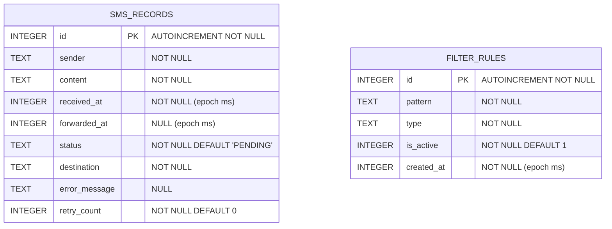

# Base de données — SMS Forwarder

## Table des matières

- [Vue d'ensemble](#vue-densemble)
- [Diagramme ER](#diagramme-er)
- [Table `sms_records`](#table-sms_records)
- [Table `filter_rules`](#table-filter_rules)
- [Enums](#enums)
- [DAOs — requêtes documentées](#daos--requêtes-documentées)
- [Migrations futures](#migrations-futures)

---

## Vue d'ensemble

L'application utilise **Room 2.6.1** avec SQLite comme moteur de stockage local. La base de données est nommée `sms_forwarder_db` et contient deux tables indépendantes sans relation de clé étrangère entre elles.

La configuration Room :

```kotlin
@Database(
    entities = [SmsRecord::class, FilterRule::class],
    version = 1,
    exportSchema = false
)
abstract class AppDatabase : RoomDatabase()
```

`exportSchema = false` désactive la génération du fichier JSON de schéma. Pour un projet en production avec des migrations, il est recommandé de passer cette option à `true` et de versionner les schémas exportés.

---

## Diagramme ER



Les deux tables sont indépendantes. Un `SmsRecord` n'a pas de clé étrangère vers `FilterRule` : la règle qui a causé le filtrage est consignée dans le champ `error_message` sous forme de texte lisible (ex. `"Not in whitelist"`).

---

## Table `sms_records`

Stocke l'historique complet de tous les messages traités par l'application, qu'ils aient été transférés, filtrés ou en échec.

### Colonnes

| Colonne | Type SQL | Contraintes | Description |
|---|---|---|---|
| `id` | `INTEGER` | `PRIMARY KEY AUTOINCREMENT NOT NULL` | Identifiant unique auto-généré |
| `sender` | `TEXT` | `NOT NULL` | Numéro de l'expéditeur, tel que reçu (peut être un texte court type `SFR` ou un numéro E.164) |
| `content` | `TEXT` | `NOT NULL` | Corps complet du message |
| `received_at` | `INTEGER` | `NOT NULL` | Timestamp de réception du message en millisecondes (epoch Unix) |
| `forwarded_at` | `INTEGER` | — | Timestamp d'envoi réussi en millisecondes. `NULL` tant que le statut n'est pas `SENT` |
| `status` | `TEXT` | `NOT NULL` | Valeur textuelle de l'enum `SmsStatus`. Voir la section [Enums](#enums) |
| `destination` | `TEXT` | `NOT NULL` | Numéro de destination configuré au moment du traitement, au format normalisé E.164 |
| `error_message` | `TEXT` | — | Message d'erreur en cas de statut `FAILED` ou raison du filtrage en cas de statut `FILTERED`. `NULL` si succès |
| `retry_count` | `INTEGER` | `NOT NULL DEFAULT 0` | Nombre de tentatives d'envoi effectuées. Incrémenté par `SmsRetryManager` à chaque essai |

### Comportements importants

**Transition de statut** : la mise à jour de `forwarded_at` est automatique dans `SmsRepositoryImpl.updateStatus()` : si le nouveau statut est `SENT`, `forwarded_at` reçoit `System.currentTimeMillis()`. Pour tout autre statut, `forwarded_at` reste inchangé.

**Insertion initiale** : chaque message est inséré avec le statut `PENDING` avant que l'envoi soit tenté. Si l'envoi réussit, le statut passe à `SENT`. En cas d'exception, il passe à `FAILED`. Si le filtre bloque le message, il est directement inséré avec le statut `FILTERED`.

**Pas de suppression partielle** : seule `deleteAllRecords()` est exposée. Il n'existe pas de suppression individuelle par conception — l'historique est une trace d'audit.

---

## Table `filter_rules`

Stocke les règles de filtrage configurées par l'utilisateur.

### Colonnes

| Colonne | Type SQL | Contraintes | Description |
|---|---|---|---|
| `id` | `INTEGER` | `PRIMARY KEY AUTOINCREMENT NOT NULL` | Identifiant unique auto-généré |
| `pattern` | `TEXT` | `NOT NULL` | Numéro de téléphone (format libre, sera normalisé à l'évaluation) ou mot-clé à rechercher dans l'expéditeur ou le corps du message |
| `type` | `TEXT` | `NOT NULL` | Valeur textuelle de l'enum `FilterType` : `"WHITELIST"` ou `"BLACKLIST"` |
| `is_active` | `INTEGER` | `NOT NULL DEFAULT 1` | Room stocke les `Boolean` en `INTEGER` (0 = false, 1 = true). Une règle inactive est ignorée par `FilterEngine` sans être supprimée |
| `created_at` | `INTEGER` | `NOT NULL` | Timestamp de création de la règle en millisecondes (epoch Unix) |

### Comportements importants

**Activation/désactivation** : `ManageFiltersUseCase.toggleRule()` crée une copie de la règle avec `isActive` inversé via `record.copy(isActive = !rule.isActive)`. La règle reste en base et peut être réactivée.

**Évaluation** : `FilterEngine` appelle `FilterRuleDao.getActiveRules()` qui filtre sur `is_active = 1`. Seules les règles actives participent à l'évaluation. La logique de correspondance distingue les numéros de téléphone (comparaison après normalisation E.164) des mots-clés (recherche dans sender + content, insensible à la casse).

**Suppression globale** : `ManageFiltersUseCase.deleteAllRules()` supprime toutes les règles et remet le mode de filtrage à `NONE` dans les `SharedPreferences`.

---

## Enums

Les enums sont stockés sous forme de `TEXT` dans SQLite pour faciliter les requêtes SQL directes et éviter les dépendances sur les valeurs ordonnées.

### SmsStatus

Défini dans `data/local/entity/SmsRecord.kt`.

| Valeur | Texte SQL | Description |
|---|---|---|
| `SmsStatus.PENDING` | `"PENDING"` | Message reçu et enregistré, envoi en cours ou en attente |
| `SmsStatus.SENT` | `"SENT"` | Message transféré avec succès |
| `SmsStatus.FAILED` | `"FAILED"` | Envoi échoué. Le champ `error_message` contient la cause |
| `SmsStatus.FILTERED` | `"FILTERED"` | Message bloqué par une règle de filtrage. Le champ `error_message` contient la raison (`"Not in whitelist"`, `"Matches blacklist rule"`) |

Conversion depuis une valeur texte :

```kotlin
SmsStatus.fromValue("SENT")   // -> SmsStatus.SENT
SmsStatus.fromValue("UNKNOWN") // -> IllegalArgumentException
```

### FilterType

Défini dans `data/local/entity/FilterRule.kt`.

| Valeur | Texte SQL | Description |
|---|---|---|
| `FilterType.WHITELIST` | `"WHITELIST"` | Règle de liste blanche : les messages correspondants sont autorisés |
| `FilterType.BLACKLIST` | `"BLACKLIST"` | Règle de liste noire : les messages correspondants sont bloqués |

### FilterMode (SharedPreferences, pas en base)

Défini dans `domain/validator/FilterEngine.kt`. Stocké dans `PreferencesManager.filterMode` sous forme de texte.

| Valeur | Texte | Description |
|---|---|---|
| `FilterMode.NONE` | `"NONE"` | Aucun filtrage, tous les messages sont transférés |
| `FilterMode.WHITELIST` | `"WHITELIST"` | Seuls les messages avec une règle WHITELIST correspondante sont transférés |
| `FilterMode.BLACKLIST` | `"BLACKLIST"` | Les messages avec une règle BLACKLIST correspondante sont bloqués |

---

## DAOs — requêtes documentées

### SmsRecordDao

**`getAllRecords(): Flow<List<SmsRecord>>`**

```sql
SELECT * FROM sms_records ORDER BY received_at DESC
```

Utilisé par `HistoryScreen` pour l'affichage de l'historique complet. Le `Flow` émet une nouvelle liste à chaque modification de la table.

**`getRecordsByStatus(status: String): Flow<List<SmsRecord>>`**

```sql
SELECT * FROM sms_records WHERE status = :status ORDER BY received_at DESC
```

Utilisé pour le filtrage par statut dans l'historique et par `SmsRetryManager.retryAllFailed()`.

**`getRecordsPaginated(limit: Int, offset: Int): List<SmsRecord>`**

```sql
SELECT * FROM sms_records ORDER BY received_at DESC LIMIT :limit OFFSET :offset
```

Requête paginée pour les exports en masse. Non utilisée actuellement dans l'UI (l'affichage utilise `getAllRecords()`).

**`getRecordCount(): Flow<Int>`**

```sql
SELECT COUNT(*) FROM sms_records
```

**`getRecordCountByStatus(status: String): Flow<Int>`**

```sql
SELECT COUNT(*) FROM sms_records WHERE status = :status
```

Ces deux méthodes sont combinées dans `GetStatsUseCase.getOverallStats()` via `combine()` pour calculer les statistiques en temps réel.

**`getRecordsForDateRange(startMs: Long, endMs: Long): List<SmsRecord>`**

```sql
SELECT * FROM sms_records
WHERE received_at BETWEEN :startMs AND :endMs
ORDER BY received_at DESC
```

Utilisé par `GetStatsUseCase.getDailyStats()` pour calculer les statistiques journalières. `startMs` et `endMs` correspondent aux bornes calculées par `DateFormatter.getStartOfDay()` et `DateFormatter.getEndOfDay()`.

**`searchRecords(query: String): Flow<List<SmsRecord>>`**

```sql
SELECT * FROM sms_records
WHERE sender LIKE '%' || :query || '%' OR content LIKE '%' || :query || '%'
ORDER BY received_at DESC
```

Recherche full-text partielle (LIKE) sur le numéro d'expéditeur et le corps du message. Pas d'index FTS configuré actuellement — une migration vers FTS5 est recommandée si l'historique devient volumineux.

**`deleteAllRecords()`**

```sql
DELETE FROM sms_records
```

### FilterRuleDao

**`getAllRules(): Flow<List<FilterRule>>`**

```sql
SELECT * FROM filter_rules ORDER BY created_at DESC
```

**`getActiveRules(): List<FilterRule>`**

```sql
SELECT * FROM filter_rules WHERE is_active = 1
```

Requête suspendue (non-Flow) appelée au moment de l'évaluation d'un message par `FilterEngine`. Retourne l'état courant des règles actives.

**`getRulesByType(type: String): Flow<List<FilterRule>>`**

```sql
SELECT * FROM filter_rules WHERE type = :type ORDER BY created_at DESC
```

---

## Migrations futures

La base de données est actuellement en version 1 avec `exportSchema = false`. Pour toute modification de schéma, suivre la procédure ci-dessous.

### Activer l'export du schéma

Modifier `AppDatabase.kt` et `build.gradle.kts` pour activer l'export :

```kotlin
// AppDatabase.kt
@Database(
    entities = [SmsRecord::class, FilterRule::class],
    version = 2, // incrémenter
    exportSchema = true // activer
)
```

```kotlin
// app/build.gradle.kts
android {
    defaultConfig {
        javaCompileOptions {
            annotationProcessorOptions {
                arguments["room.schemaLocation"] = "$projectDir/schemas"
            }
        }
    }
}
```

### Écrire la migration

```kotlin
val MIGRATION_1_2 = object : Migration(1, 2) {
    override fun migrate(database: SupportSQLiteDatabase) {
        // Exemple : ajout d'une colonne
        database.execSQL(
            "ALTER TABLE sms_records ADD COLUMN source TEXT NOT NULL DEFAULT 'sms'"
        )
    }
}
```

### Déclarer la migration dans le DatabaseModule

```kotlin
Room.databaseBuilder(context, AppDatabase::class.java, "sms_forwarder_db")
    .addMigrations(MIGRATION_1_2)
    .build()
```

### Règles de migration

- Ne jamais modifier une migration existante déjà déployée.
- Toujours écrire un test de migration avec `MigrationTestHelper`.
- Les colonnes ajoutées doivent avoir une valeur `DEFAULT` pour compatibilité avec les données existantes.
- Tester la migration sur un appareil avec une base de données existante avant de publier.

### Évolutions identifiées

| Évolution | Justification | Impact |
|---|---|---|
| Index sur `sms_records.received_at` | Améliorer les performances de `getRecordsForDateRange()` avec des historiques volumineux | Migration DDL simple (`CREATE INDEX`) |
| FTS5 sur `sms_records` | Recherche full-text performante sur `sender` et `content` | Migration avec création table virtuelle |
| Colonne `source` dans `sms_records` | Tracer l'origine du message (`sms`, `content_observer`, `notification`) | ALTER TABLE avec DEFAULT |
| Index sur `filter_rules.is_active` | Optimiser `getActiveRules()` | Migration DDL simple |
