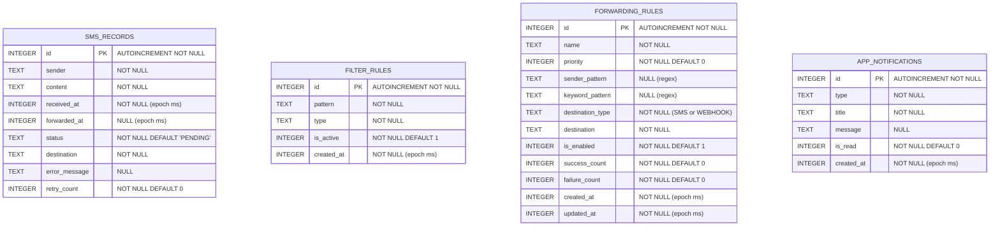

# Database — SMS Forwarder

🇫🇷 [Français](DATABASE.md) | 🇬🇧 English

## Table of contents

- [Overview](#overview)
- [ER diagram](#er-diagram)
- [`sms_records` table](#sms_records-table)
- [`filter_rules` table](#filter_rules-table)
- [Enums](#enums)
- [DAOs — documented queries](#daos--documented-queries)
- [Future migrations](#future-migrations)

---

## Overview

The application uses **Room 2.6.1** with SQLite as the local storage engine. The database is named `sms_forwarder_db` and contains two independent tables with no foreign key relationship between them.

The Room configuration:

```kotlin
@Database(
    entities = [SmsRecord::class, FilterRule::class, ForwardingRule::class, AppNotification::class],
    version = 2,
    exportSchema = false
)
abstract class AppDatabase : RoomDatabase()
```

The v1 → v2 migration is non-destructive: addition of the `forwarding_rules` and `app_notifications` tables via `MIGRATION_1_2`.

`exportSchema = false` disables the generation of the schema JSON file. For a production project with migrations, it is recommended to set this option to `true` and version the exported schemas.

---

## ER diagram



The four tables are independent (no foreign keys). `ForwardingRule` is distinct from `FilterRule` (SRP: filtering vs routing).

---

## `sms_records` table

Stores the complete history of all messages processed by the application, whether they were forwarded, filtered or failed.

### Columns

| Column | SQL type | Constraints | Description |
|---|---|---|---|
| `id` | `INTEGER` | `PRIMARY KEY AUTOINCREMENT NOT NULL` | Auto-generated unique identifier |
| `sender` | `TEXT` | `NOT NULL` | Sender's number, as received (can be a short text like `SFR` or an E.164 number) |
| `content` | `TEXT` | `NOT NULL` | Full message body |
| `received_at` | `INTEGER` | `NOT NULL` | Message reception timestamp in milliseconds (Unix epoch) |
| `forwarded_at` | `INTEGER` | — | Successful send timestamp in milliseconds. `NULL` as long as the status is not `SENT` |
| `status` | `TEXT` | `NOT NULL` | Textual value of the `SmsStatus` enum. See the [Enums](#enums) section |
| `destination` | `TEXT` | `NOT NULL` | Destination number configured at processing time, in normalized E.164 format |
| `error_message` | `TEXT` | — | Error message if status is `FAILED` or filtering reason if status is `FILTERED`. `NULL` on success |
| `retry_count` | `INTEGER` | `NOT NULL DEFAULT 0` | Number of send attempts performed. Incremented by `SmsRetryManager` on each attempt |

### Important behaviors

**Status transition**: the `forwarded_at` update is automatic in `SmsRepositoryImpl.updateStatus()`: if the new status is `SENT`, `forwarded_at` receives `System.currentTimeMillis()`. For any other status, `forwarded_at` remains unchanged.

**Initial insertion**: each message is inserted with the `PENDING` status before the send is attempted. If the send succeeds, the status changes to `SENT`. On exception, it changes to `FAILED`. If the filter blocks the message, it is directly inserted with the `FILTERED` status.

**No partial deletion**: only `deleteAllRecords()` is exposed. There is no individual deletion by design — the history is an audit trail.

---

## `filter_rules` table

Stores the filtering rules configured by the user.

### Columns

| Column | SQL type | Constraints | Description |
|---|---|---|---|
| `id` | `INTEGER` | `PRIMARY KEY AUTOINCREMENT NOT NULL` | Auto-generated unique identifier |
| `pattern` | `TEXT` | `NOT NULL` | Phone number (free format, will be normalized at evaluation time) or keyword to search in the sender or message body |
| `type` | `TEXT` | `NOT NULL` | Textual value of the `FilterType` enum: `"WHITELIST"` or `"BLACKLIST"` |
| `is_active` | `INTEGER` | `NOT NULL DEFAULT 1` | Room stores `Boolean` as `INTEGER` (0 = false, 1 = true). An inactive rule is ignored by `FilterEngine` without being deleted |
| `created_at` | `INTEGER` | `NOT NULL` | Rule creation timestamp in milliseconds (Unix epoch) |

### Important behaviors

**Enable/disable**: `ManageFiltersUseCase.toggleRule()` creates a copy of the rule with `isActive` inverted via `record.copy(isActive = !rule.isActive)`. The rule remains in the database and can be re-enabled.

**Evaluation**: `FilterEngine` calls `FilterRuleDao.getActiveRules()` which filters on `is_active = 1`. Only active rules participate in the evaluation. The matching logic distinguishes phone numbers (comparison after E.164 normalization) from keywords (search in sender + content, case-insensitive).

**Bulk deletion**: `ManageFiltersUseCase.deleteAllRules()` deletes all rules and resets the filtering mode to `NONE` in the `SharedPreferences`.

---

## Enums

Enums are stored as `TEXT` in SQLite to facilitate direct SQL queries and avoid dependencies on ordered values.

### SmsStatus

Defined in `data/local/entity/SmsRecord.kt`.

| Value | SQL text | Description |
|---|---|---|
| `SmsStatus.PENDING` | `"PENDING"` | Message received and registered, sending in progress or pending |
| `SmsStatus.SENT` | `"SENT"` | Message forwarded successfully |
| `SmsStatus.FAILED` | `"FAILED"` | Send failed. The `error_message` field contains the cause |
| `SmsStatus.FILTERED` | `"FILTERED"` | Message blocked by a filtering rule. The `error_message` field contains the reason (`"Not in whitelist"`, `"Matches blacklist rule"`) |

Conversion from a text value:

```kotlin
SmsStatus.fromValue("SENT")   // -> SmsStatus.SENT
SmsStatus.fromValue("UNKNOWN") // -> IllegalArgumentException
```

### FilterType

Defined in `data/local/entity/FilterRule.kt`.

| Value | SQL text | Description |
|---|---|---|
| `FilterType.WHITELIST` | `"WHITELIST"` | Whitelist rule: matching messages are allowed |
| `FilterType.BLACKLIST` | `"BLACKLIST"` | Blacklist rule: matching messages are blocked |

### FilterMode (SharedPreferences, not in database)

Defined in `domain/validator/FilterEngine.kt`. Stored in `PreferencesManager.filterMode` as text.

| Value | Text | Description |
|---|---|---|
| `FilterMode.NONE` | `"NONE"` | No filtering, all messages are forwarded |
| `FilterMode.WHITELIST` | `"WHITELIST"` | Only messages with a matching WHITELIST rule are forwarded |
| `FilterMode.BLACKLIST` | `"BLACKLIST"` | Messages with a matching BLACKLIST rule are blocked |

---

## DAOs — documented queries

### SmsRecordDao

**`getAllRecords(): Flow<List<SmsRecord>>`**

```sql
SELECT * FROM sms_records ORDER BY received_at DESC
```

Used by `HistoryScreen` to display the full history. The `Flow` emits a new list on each table modification.

**`getRecordsByStatus(status: String): Flow<List<SmsRecord>>`**

```sql
SELECT * FROM sms_records WHERE status = :status ORDER BY received_at DESC
```

Used for status filtering in the history and by `SmsRetryManager.retryAllFailed()`.

**`getRecordsPaginated(limit: Int, offset: Int): List<SmsRecord>`**

```sql
SELECT * FROM sms_records ORDER BY received_at DESC LIMIT :limit OFFSET :offset
```

Paginated query for bulk exports. Not currently used in the UI (the display uses `getAllRecords()`).

**`getRecordCount(): Flow<Int>`**

```sql
SELECT COUNT(*) FROM sms_records
```

**`getRecordCountByStatus(status: String): Flow<Int>`**

```sql
SELECT COUNT(*) FROM sms_records WHERE status = :status
```

These two methods are combined in `GetStatsUseCase.getOverallStats()` via `combine()` to compute real-time statistics.

**`getRecordsForDateRange(startMs: Long, endMs: Long): List<SmsRecord>`**

```sql
SELECT * FROM sms_records
WHERE received_at BETWEEN :startMs AND :endMs
ORDER BY received_at DESC
```

Used by `GetStatsUseCase.getDailyStats()` to compute daily statistics. `startMs` and `endMs` correspond to the bounds calculated by `DateFormatter.getStartOfDay()` and `DateFormatter.getEndOfDay()`.

**`searchRecords(query: String): Flow<List<SmsRecord>>`**

```sql
SELECT * FROM sms_records
WHERE sender LIKE '%' || :query || '%' OR content LIKE '%' || :query || '%'
ORDER BY received_at DESC
```

Partial full-text search (LIKE) on the sender number and the message body. No FTS index is currently configured — a migration to FTS5 is recommended if the history becomes large.

**`deleteAllRecords()`**

```sql
DELETE FROM sms_records
```

### FilterRuleDao

**`getAllRules(): Flow<List<FilterRule>>`**

```sql
SELECT * FROM filter_rules ORDER BY created_at DESC
```

**`getActiveRules(): List<FilterRule>`**

```sql
SELECT * FROM filter_rules WHERE is_active = 1
```

Suspended query (non-Flow) called at message evaluation time by `FilterEngine`. Returns the current state of active rules.

**`getRulesByType(type: String): Flow<List<FilterRule>>`**

```sql
SELECT * FROM filter_rules WHERE type = :type ORDER BY created_at DESC
```

---

## Future migrations

The database is currently at version 1 with `exportSchema = false`. For any schema change, follow the procedure below.

### Enable schema export

Modify `AppDatabase.kt` and `build.gradle.kts` to enable export:

```kotlin
// AppDatabase.kt
@Database(
    entities = [SmsRecord::class, FilterRule::class],
    version = 2, // increment
    exportSchema = true // enable
)
```

```kotlin
// app/build.gradle.kts
android {
    defaultConfig {
        javaCompileOptions {
            annotationProcessorOptions {
                arguments["room.schemaLocation"] = "$projectDir/schemas"
            }
        }
    }
}
```

### Write the migration

```kotlin
val MIGRATION_1_2 = object : Migration(1, 2) {
    override fun migrate(database: SupportSQLiteDatabase) {
        // Example: adding a column
        database.execSQL(
            "ALTER TABLE sms_records ADD COLUMN source TEXT NOT NULL DEFAULT 'sms'"
        )
    }
}
```

### Declare the migration in the DatabaseModule

```kotlin
Room.databaseBuilder(context, AppDatabase::class.java, "sms_forwarder_db")
    .addMigrations(MIGRATION_1_2)
    .build()
```

### Migration rules

- Never modify an existing migration that has already been deployed.
- Always write a migration test with `MigrationTestHelper`.
- Added columns must have a `DEFAULT` value for compatibility with existing data.
- Test the migration on a device with an existing database before publishing.

### Identified improvements

| Improvement | Justification | Impact |
|---|---|---|
| Index on `sms_records.received_at` | Improve `getRecordsForDateRange()` performance with large histories | Simple DDL migration (`CREATE INDEX`) |
| FTS5 on `sms_records` | Performant full-text search on `sender` and `content` | Migration with virtual table creation |
| `source` column in `sms_records` | Trace message origin (`sms`, `content_observer`, `notification`) | ALTER TABLE with DEFAULT |
| Index on `filter_rules.is_active` | Optimize `getActiveRules()` | Simple DDL migration |
